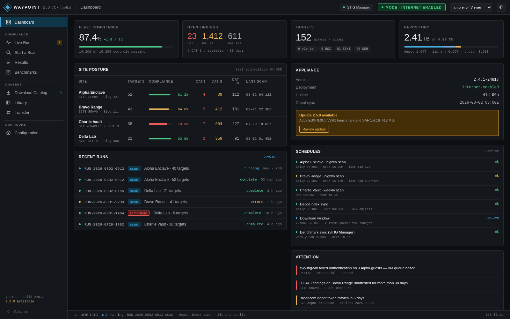
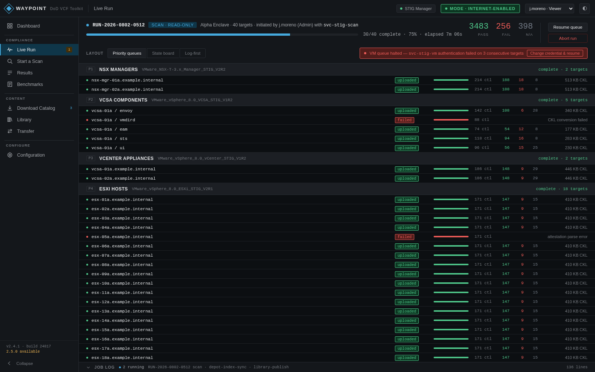
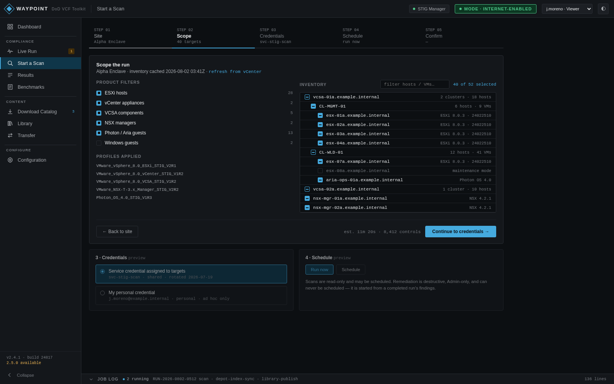
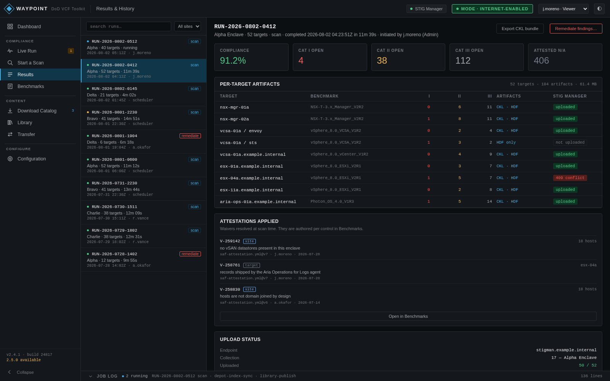
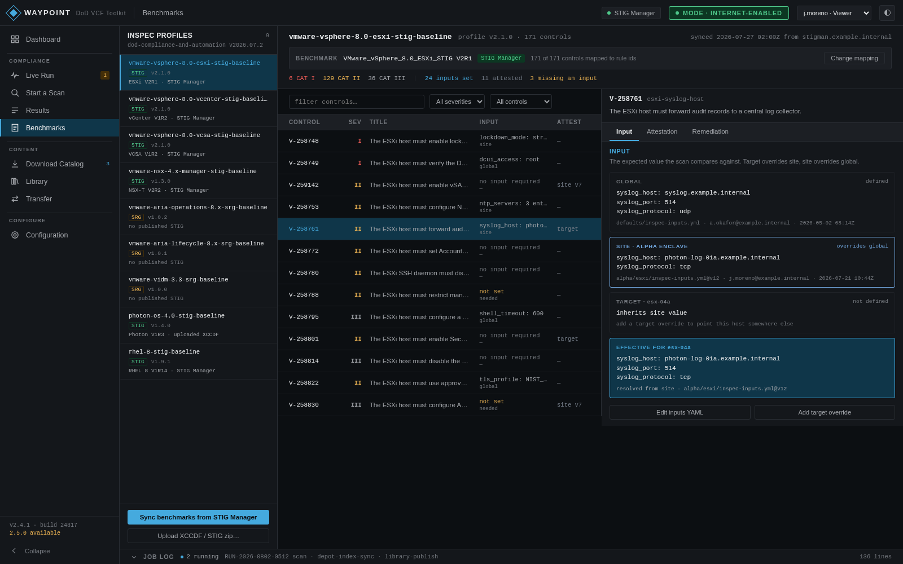
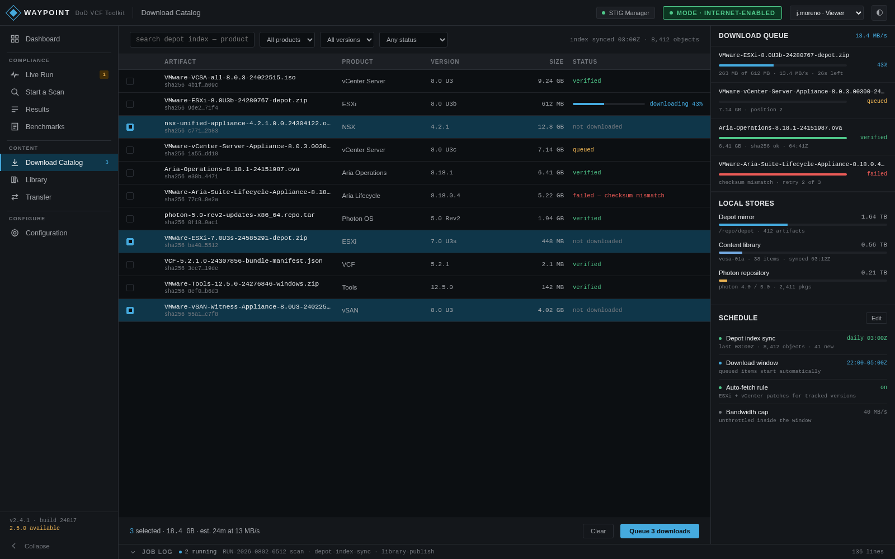
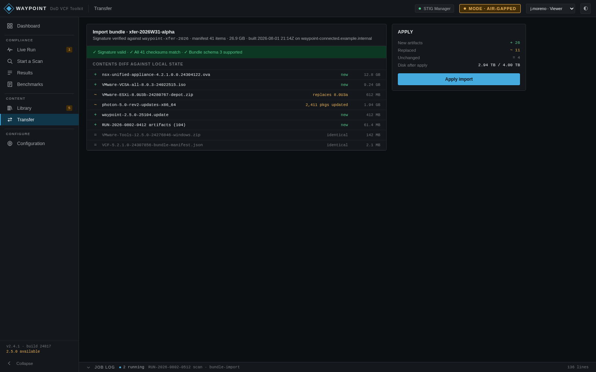
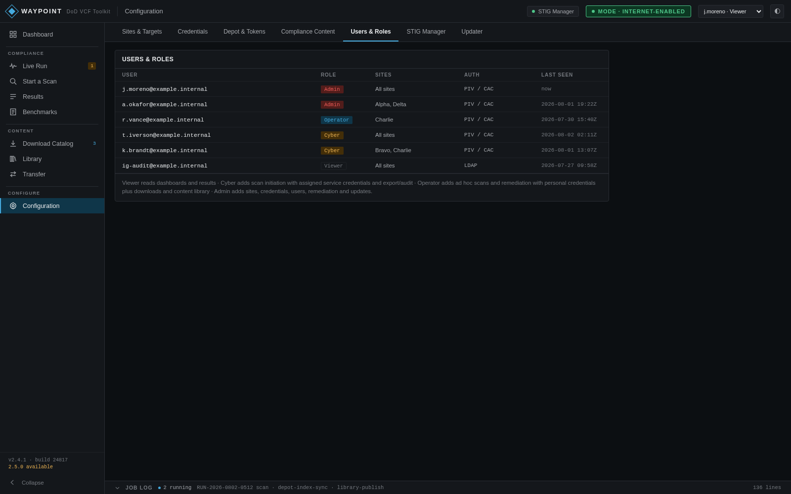

# Waypoint

A self-hosted appliance for managing VMware Cloud Foundation compliance, software,
and cross-enclave operations from one web interface.

Waypoint is distributed as source, Dockerfiles, and Compose configuration. Operators
build the appliance in their own environment, acquire entitled tools and content with
their own accounts, and move the resulting capabilities into disconnected enclaves.

## What Waypoint does

- **Maps infrastructure** — organizes sites and targets, validates credentials, and
  caches vCenter inventory for repeatable operations.
- **Runs compliance workflows** — manages profiles, benchmarks, inputs, attestations,
  scans, results, exports, and explicitly authorized remediation across VCF systems.
- **Manages software content** — indexes depots, downloads and verifies artifacts,
  tracks repository presence, and manages content needed by connected and disconnected
  environments.
- **Bridges air gaps** — composes signed transfer bundles containing the selected
  software, compliance content, installed tooling, and appliance updates required on
  the receiving side.
- **Preserves control and evidence** — encrypts stored secrets, enforces role-based
  actions, records job and audit history, streams live progress, and separates import
  from intentional remediation or update application.
- **Deploys as one appliance** — an ASP.NET control plane coordinates dedicated
  compliance and download runners through a durable PostgreSQL job and event boundary.

## Feature tour

> **Prototype placeholders:** The screenshots below come from Waypoint's high-fidelity
> design prototype and use fictional data. They illustrate the intended product
> experience, not the exact state of the production UI, and will be replaced with
> production captures as those screens are finalized. See the [roadmap](docs/roadmap.md)
> for the authoritative built-versus-planned status of each capability.

### See posture, activity, schedules, and attention items at a glance

The operations dashboard brings fleet compliance, findings, repository capacity,
recent runs, read-only schedules, appliance health, and actionable warnings together.

### Follow concurrent compliance work from one live workspace

Live Jobs presents runner-owned progress, priority queues, per-target state, failures,
controls, and persisted logs without allowing one failed target to stop the run.

### Plan repeatable scans from cached infrastructure inventory

Operators select sites, products, discovered targets, profiles, credentials, and a
run-now or scheduled path before submitting a read-only scan.

### Preserve findings, evidence, attestations, and export status

Compliance results connect run history to per-target artifacts, severity counts,
applied attestations, STIG Manager uploads, and explicitly authorized remediation.

### Manage benchmark inputs and auditor-facing decisions

The benchmark workspace maps profiles to XCCDF content and resolves versioned inputs,
attestations, and remediation configuration from global to site to target scope.

### Index, download, verify, and organize entitled software

Connected appliances browse the indexed depot, queue downloads, verify checksums,
track local storage, and manage the content needed by VCF environments.

### Move signed content across an air gap

The planned transfer workflow builds signed bundles on a connected appliance, then
validates signatures, checksums, schema, and local-state differences before import on
a disconnected appliance.

### Enforce centralized identity and role boundaries

Keycloak OIDC, four application roles, site scopes, audit history, encrypted
credentials, and step-up authentication keep sensitive actions explicit and traceable.

## Documentation

The documentation records what is implemented, what is planned, and why the system is
designed this way:

- [Architecture](docs/architecture.md) — components, job engine, modes, and update flow
- [Domain model](docs/domain-model.md) — sites, targets, credentials, roles
- [Security](docs/security.md) — secrets threat model and leakage controls
- [ADRs](docs/adr/) — the decisions and why
- [Roadmap](docs/roadmap.md) — build sequencing
- [UI design brief](docs/ui/design-brief.md) — screen inventory and prototype reconciliation
- [API contract](docs/api-contract.md) — REST/SSE contract, state machines, and data ledger
- [Testing](docs/testing.md) — required reading before running the Compose stack

## License

Copyright 2026 Justin Black. Licensed under the [Apache License, Version 2.0](LICENSE).

Third-party code may only be incorporated under the borrowing policy in
[CLAUDE.md](CLAUDE.md) — permissive licenses with attribution, no copyleft, no vendor
binaries — and is recorded in [NOTICE](NOTICE).

### No warranty

Waypoint scans and, when explicitly instructed, **modifies production infrastructure**.
It is provided "AS IS", without warranties or conditions of any kind, and without
liability, as set out in sections 7 and 8 of the License. Remediation is destructive by
design: review what a run will change before you confirm it.

### Vendor software is not redistributed

Waypoint orchestrates tools an operator is authorized to acquire; the project does not
publish completed images or entitlement-restricted artifacts.

- Broadcom's `vcf-download-tool` is absent from the public source repository and runner
  build. A connected operator installs it through Waypoint using their own authorized
  upstream or a local/manual source; operator-created transfer bundles carry required
  installed tooling across the operator's air gap.
- Waypoint's execution services, Dockerfiles, orchestration, and PowerShell are built
  from this repository. Entitlement-restricted executables and compliance content
  remain operator-acquired managed appliance state.

Obtaining these under your own entitlement, and complying with their licenses, is your
responsibility as the operator.

### Trademarks

"VMware", "vSphere", "VCF", "vCenter", "ESXi", "NSX", "Aria", "Photon" and "Broadcom"
are trademarks of Broadcom Inc. and/or its subsidiaries. Other product and company
names are the marks of their respective owners.

They are used here **only to describe the systems this software interoperates with**,
which is nominative use. This project is not affiliated with, endorsed by, sponsored by,
or supported by Broadcom Inc., VMware, or any government agency. Section 6 of the
License grants no trademark rights.

## Contributing note

This is a **public repository** developed against private infrastructure. No real
hostnames, IPs, credentials, or Broadcom/VMware account data may appear here — see
[CLAUDE.md](CLAUDE.md) for the full sanitization policy. All examples use fictional
placeholders.

Contributions are welcome. Read [CONTRIBUTING.md](CONTRIBUTING.md) before opening a
pull request, and participate according to the [Code of Conduct](CODE_OF_CONDUCT.md).
