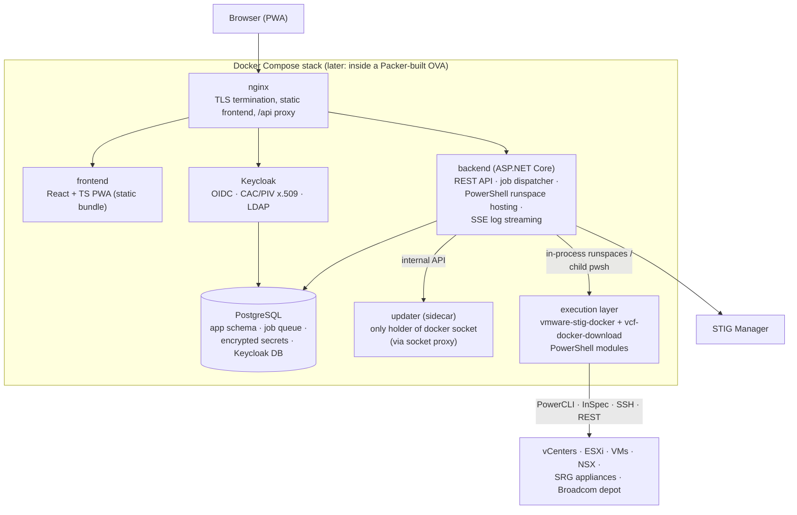

# Waypoint — System Architecture

Status: **draft, planning phase**. Decisions referenced here are recorded as ADRs in
[`adr/`](adr/); this document describes how they fit together.

## What Waypoint is

A self-hosted web appliance that unifies VMware STIG compliance
([vmware-stig-docker](https://github.com/blac9216/vmware-stig-docker)) and VCF artifact
download/repository management
([vcf-docker-download](https://github.com/blac9216/vcf-docker-download)) for DoD-style
environments. The existing PowerShell codebases are retained as the **execution layer**;
Waypoint adds the **control plane**: UI, API, job orchestration, credential store, RBAC,
and cross-enclave transfer.

## Deployment topology: one appliance, two modes

The same appliance image deploys on both sides of the air gap ([ADR-0010](adr/0010-deployment-topology.md)):

| | Connected instance | Disconnected instances |
|---|---|---|
| Internet | Yes (Broadcom depot reachable) | No |
| STIG scan / remediate | ✅ | ✅ |
| Download manager / catalog browser | ✅ | Hidden/disabled |
| Transfer | **Builds** signed export bundles | **Imports** and validates bundles |
| Updates | Optional online check + bundle upload | Bundle upload only |

The mode is instance configuration, surfaced as a persistent badge in the UI. Feature
availability derives from the mode — there is one codebase and one image, never a fork.

## Component view

## The job engine (the heart of the product)

Everything long-running is a **job**: a scan of a site, a remediation of a component, an
artifact download, an inventory discovery, a bundle export/import, a catalog index. One
engine serves both products and all future features ([ADR-0008](adr/0008-job-engine.md)).

- **Queue**: Postgres table claimed with `SELECT … FOR UPDATE SKIP LOCKED`. No Redis or
  message broker at this scale.
- **Priority**: carried over from the STIG catalog's declared `reportGroup`/`priority`
  model (NSX=1, VCSA=2, vCenter=3, ESXi=4, VM=5, SRG=6) as a priority column; other job
  types declare their own.
- **Execution**: the backend hosts PowerShell runspace pools **in-process** via
  `System.Management.Automation` ([ADR-0006](adr/0006-backend-language.md)). The existing
  modules (transports, catalog, scan scriptblocks, download workflows) are invoked from
  runspaces; real objects flow between C# and PowerShell — no stdout parsing.
  Remediation keeps its child-`pwsh` isolation (vendor scripts call `Exit`).
- **Streaming**: per-job log and state events go to the UI over SSE (WebSocket if SSE
  proves insufficient). Logs and results also persist to Postgres for history.
- **State machine** (per target within a run): `queued → running → attesting →
  converting → uploaded | done | failed`. Failures never halt the run (Continue
  strategy, inherited from the STIG runner).
- The runspace-pool engine in `module.parallelism.ps1` stops being the orchestrator;
  the job service takes that role and the modules become workers.

## Discovery is a job type

Host/VM inventory is discovered from each vCenter (AllLinked connect, as today) and
**snapshotted into Postgres**, so the UI can render checkbox target-selection without a
live vCenter connection. The UI shows last-refreshed time; scans trigger an automatic
refresh before running; operators can refresh on demand.

## Identity & authorization

Keycloak is the IdP ([ADR-0004](adr/0004-identity-keycloak.md)); the backend is a plain
OIDC client so the IdP stays swappable. Roles — **Viewer, Cyber, Operator, Admin** —
are defined in [domain-model.md](domain-model.md) along with the credential ownership
model (personal vs shared/service credentials).

## Secrets

Envelope encryption in Postgres, AWX-style ([ADR-0005](adr/0005-secrets.md)): per-secret
data keys wrapped by a master key mounted as a file/Docker secret (same operator model
as the current `STIG_VAULT_PASSWORD_FILE`). Secrets are write-only through the API.
External Vault/OpenBao support is a later, pluggable option — not v1.

## Self-update

Signed update bundles uploaded through the UI ([ADR-0009](adr/0009-self-update.md)):
validate signature/versions → `docker load` → dedicated updater sidecar (sole holder of
the Docker socket, behind a socket proxy) recreates changed services → health-check gate
→ keep previous tags for rollback. The updater updates itself via a transient one-shot
runner container. In the eventual OVA, the same bundle is applied by a host-side systemd
unit instead.

## Cross-enclave transfer

The `Transfer/` directory convention from vcf-docker-download becomes a first-class
feature: the connected instance composes a **signed export bundle** (selected artifacts,
repos, content-library deltas, catalog index); disconnected instances import, verify the
signature and checksums, and show a contents diff against local state before applying.
The update bundle and the transfer bundle share one signing/manifest format.

## What Waypoint deliberately is not

- **Not Kubernetes.** A single-node compose stack (optionally wrapped in an OVA) is the
  right operational weight ([ADR-0001](adr/0001-packaging.md)).
- **Not a rewrite.** PowerShell domain logic survives; only the orchestration and UI
  layers are new.
- **Not zero-downtime.** A few seconds of per-service restart during updates is
  accepted appliance behavior.

## Prior art studied

AWX (credential store + job engine pattern), Rundeck, Semaphore UI — all are
"web UI + credentials + jobs against infrastructure." Waypoint is a domain-specific
member of that family.
