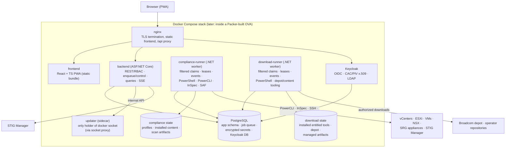

# Waypoint — System Architecture

Status: **living document, approved architecture ahead of implementation** (M0–M3 are
built; M4+ remain design intent — see [`roadmap.md`](roadmap.md)). This describes the
target-state system; decisions are recorded as ADRs in [`adr/`](adr/). Sections below
are marked ✅ **Built** (shipped in M1–M3, epics
[#1](https://github.com/blac9216/waypoint/issues/1)/[#13](https://github.com/blac9216/waypoint/issues/13)/[#14](https://github.com/blac9216/waypoint/issues/14)),
🚧 **In transition** (approved replacement is not yet implemented), or
📋 **Planned** (M4+) so a reader can tell what exists from what is still design intent.
Do not read a 📋 marker as license to change the described design without an ADR.

## What Waypoint is

A self-hosted web appliance that unifies VMware STIG compliance
([vmware-stig-docker](https://github.com/blac9216/vmware-stig-docker)) and VCF artifact
download/repository management
([vcf-docker-download](https://github.com/blac9216/vcf-docker-download)) for DoD-style
environments. Project-owned Dockerfiles, orchestration, and PowerShell from the two
predecessor repositories migrate into dedicated execution runners. Waypoint's
**control plane** is the UI/API, credential store, RBAC, job control, history/SSE, and
cross-enclave transfer; it does not execute domain tools (ADR-0013).

## Deployment topology: one appliance, two modes

📋 **Planned (M6, epic [#17](https://github.com/blac9216/waypoint/issues/17)).** Today
there is one mode: a single connected-style dev/compose deployment, now with Keycloak
OIDC as the production sign-in path (M3). Mode enforcement, the disconnected variant,
and transfer bundles are not yet built.

The same operator-built Compose topology deploys on both sides of the air gap
([ADR-0010](adr/0010-deployment-topology.md), [ADR-0015](adr/0015-source-build-and-operator-export.md)):

| | Connected instance | Disconnected instances |
|---|---|---|
| Internet | Yes (Broadcom depot reachable) | No |
| STIG scan / remediate | ✅ | ✅ |
| Download manager / catalog browser | ✅ | Hidden/disabled |
| Transfer | **Builds** signed export bundles | **Imports** and validates bundles |
| Updates | Optional online check + bundle upload | Bundle upload only |

The mode is instance configuration, surfaced as a persistent badge in the UI. Feature
availability derives from the mode — there is one codebase and one image, never a fork.

## Component view

✅ **Built**: nginx, frontend, Postgres, the STIG Manager connection (M1/M2), the
split of the once-combined backend into a control-plane API plus dedicated
`compliance-runner` and `download-runner` services (ADRs 0013/0014, issue #443) — the
API process references neither the PowerShell SDK nor any job handler at build time
(`backend/Waypoint.Infrastructure.Execution` is a separate project only the two
runners reference) — and Keycloak as the IdP (M3, epic #14): its own Postgres
database, scripted realm bootstrap, and OIDC bearer-token validation/PKCE login
wired through nginx and the backend. 📋 **Planned**: updater/exporter and transfer
automation (M6/M7).

## The job engine (the heart of the product)

✅ **Built** (M1/M2, ADRs 0013/0014, issue #443): queue, dispatcher, priority,
in-process PowerShell runspace hosting, SSE streaming, and the per-target state
machine below are live, serving `catalog-index`/`download` (M1) and discovery/scan/
NSX/SRG job types (M2). Cooperative per-job cancellation (issue #234) and
lease-recovery sweeps also shipped. Execution ownership is now the two long-lived
runners' alone: each runner atomically claims only its allowlisted job types, owns the
lease and cancellation for work it executes, and writes structured events directly to
Postgres. `Waypoint.Api` retains the durable queue/state/event contracts —
enqueue/control/query, migrations, and the SSE feed the UI reads from persisted
events — but hosts no dispatcher, no PowerShell, and no domain handler. Scheduling
(cron-style, read-only job types only, per-job-type minimum-role floors) is ✅ **built**
(M3, epic #14).

Everything long-running is a **job**: a scan of a site, a remediation of a component, an
artifact download, an inventory discovery, a bundle export/import, a catalog index. One
engine serves both products and all future features ([ADR-0008](adr/0008-job-engine.md)).

- **Queue**: Postgres table claimed with `SELECT … FOR UPDATE SKIP LOCKED`. No Redis or
  message broker at this scale.
- **Priority**: carried over from the STIG catalog's declared `reportGroup`/`priority`
  model (NSX=1, VCSA=2, vCenter=3, ESXi=4, VM=5, SRG=6) as a priority column; other job
  types declare their own.
- **Execution**: each .NET runner hosts its own PowerShell runspace pools in-process
  through `System.Management.Automation`; real objects flow between C# handlers and
  PowerShell without a network/stdout protocol. Remediation may keep child-`pwsh`
  isolation for code that calls `Exit`.
- **Concurrency**: a shared runner library reads container CPU/memory limits, combines
  them with measured handler resource profiles and operator caps, and admits work only
  within that budget. Exact weights/defaults await measurement. Queue/worker identity
  is replica-safe, but Compose starts one of each runner.
- **Streaming**: per-job log and state events go to the UI over SSE (WebSocket if SSE
  proves insufficient). Logs and results also persist to Postgres for history.
- **State machine** (per target within a run): `queued → running → attesting →
  converting → uploaded | done | failed`. Failures never halt the run (Continue
  strategy, inherited from the STIG runner).
- The shared C# runner library is the generic orchestrator; domain handlers and
  PowerShell modules are adaptable workers. A future execution domain adds a runner
  host/image and handler registrations rather than changing the API/queue protocol.

### Operational projection and domain results

The common engine has a global **Live Jobs** projection over every active run/job.
It groups concurrent jobs by run and delegates the selected detail to a job-type
renderer; the selected item does not constrain runner concurrency. The existing
global SSE stream drives appliance-wide activity, while per-run streams drive the
selected run and bounded persisted-event queries provide completed diagnostics.

Operational history owns lifecycle metadata, timing, redacted logs, and diagnostics.
It does not become a second store for durable outputs: compliance findings and
artifacts stay in Compliance Results, inventory stays with Targets, downloads stay in
Catalog/Library, profiles stay in Compliance Content, and bundles stay in Transfer.
Deletion follows the same boundary ([ADR-0019](adr/0019-global-job-observability.md)).

## Discovery is a job type

✅ **Built** (M2, issue #21): the `discover` job type and inventory cache below are
live.

Host/VM inventory is discovered from each vCenter (AllLinked connect, as today) and
**snapshotted into Postgres**, so the UI can render checkbox target-selection without a
live vCenter connection. The UI shows last-refreshed time; scans trigger an automatic
refresh before running; operators can refresh on demand.

## Identity & authorization

✅ **Built** (M3, epic #14). Keycloak is the IdP
([ADR-0004](adr/0004-identity-keycloak.md)), deployed in the Compose stack on its own
Postgres database with a scripted realm bootstrap (four role groups, example LDAP
federation config, CAC/PIV x.509 flow documented for site enablement). The backend is
a plain OIDC relying party: JWT bearer validation with canonical-issuer pinning
(`Oidc:ValidIssuer`, decoupled from the internal discovery address so a real
browser-minted token validates correctly behind nginx's `/auth/` proxy) and fail-closed
role-claim mapping. The SPA runs a hand-rolled authorization-code + PKCE login flow (no
external OIDC libraries), replacing the M1 local-auth form; local auth survives only as
an off-by-default dev-flag (`LocalAuth:Enabled`) for e2e/smoke-test paths, not a
supported deployment configuration. Live-verified end to end: a real browser-path PKCE
login returns a token that `GET /auth/me` accepts with the correct role claim.

Roles — **Viewer, Cyber, Operator, Admin** — are defined in
[domain-model.md](domain-model.md) along with the credential ownership model (personal
vs shared/service credentials), and are enforced on every `[Http*]`-decorated API
action across all 18 controllers, closed out by a reflection-driven endpoint × role
matrix test that fails closed on any endpoint missing from its hand-authored table.
Sensitive state changes — currently, overwriting a stored credential's secret — require
step-up re-authentication: the SPA re-runs the authorization-code flow with
`prompt=login`/`max_age=0`, Keycloak mints a fresh `auth_time` on the token via a realm
protocol mapper, and the backend rejects stale tokens with `403 step_up_required`
outside a configurable freshness window. A cron-style scheduling engine enqueues
read-only job types only — remediation is never schedulable, enforced server-side — with
per-job-type minimum-role floors. Users & Roles (read-only role display, Admin-gated
site-scope edits) and Audit (filter/paging/CSV export) surfaces round out the RBAC
picture.

## Secrets

✅ **Built** (M1, epic #1; extended M2, epic #13). Envelope encryption, write-only
API, and the shared/service credential store are live; personal (ad hoc) credentials
per ADR-0011 shipped in M2 (issue #276).

Envelope encryption in Postgres, AWX-style ([ADR-0005](adr/0005-secrets.md)): per-secret
data keys wrapped by a master key mounted as a file/Docker secret. Secrets are
write-only through the API; the API encrypts writes and a trusted runner decrypts only
for a job it has claimed, with audit/redaction at the point of use (ADR-0014).
Personal credentials are never stored in v1 — prompted at run initiation
([ADR-0011](adr/0011-credential-tiers.md)). Threat model and mandatory leakage
controls: [security.md](security.md). External Vault/OpenBao support is a later,
pluggable option — not v1.

## Self-update

📋 **Planned (M7, epic [#18](https://github.com/blac9216/waypoint/issues/18)).** Not
yet built.

Operators build Waypoint images from the public source repository (ADR-0015). A future
connected updater/exporter includes those local images and immutable digests in the
signed transfer/update format. Import validates and stages newer compatible images,
then Settings shows **Appliance update available**. Only a separate explicit Admin
apply invokes `docker load` and the dedicated updater sidecar, health gate, and rollback
flow from ADR-0009.

## Cross-enclave transfer

📋 **Planned (M6, epic [#17](https://github.com/blac9216/waypoint/issues/17)).** Not
yet built.

The predecessor transfer convention becomes a first-class feature: the connected
instance composes an operator-created **signed export bundle** containing locally built
appliance images when selected/required, installed tooling required by the selected
functions, compliance content, selected artifacts, repository/content-library deltas,
and catalog indexes. Disconnected instances verify signatures/checksums and show a
contents diff. The update and transfer payloads share one versioned manifest envelope;
content import and appliance-update apply remain distinct actions.

## What Waypoint deliberately is not

- **Not Kubernetes.** A single-node compose stack (optionally wrapped in an OVA) is the
  right operational weight ([ADR-0001](adr/0001-packaging.md)).
- **Not a rewrite.** PowerShell domain logic survives; only the orchestration and UI
  layers are new.
- **Not a publisher of completed appliance images or entitled tools.** The public
  repository supplies source/build definitions; operators build, provision, and
  export their own appliance state (ADR-0015).
- **Not zero-downtime.** A few seconds of per-service restart during updates is
  accepted appliance behavior.

## Prior art studied

AWX (credential store + job engine pattern), Rundeck, Semaphore UI — all are
"web UI + credentials + jobs against infrastructure." Waypoint is a domain-specific
member of that family.
