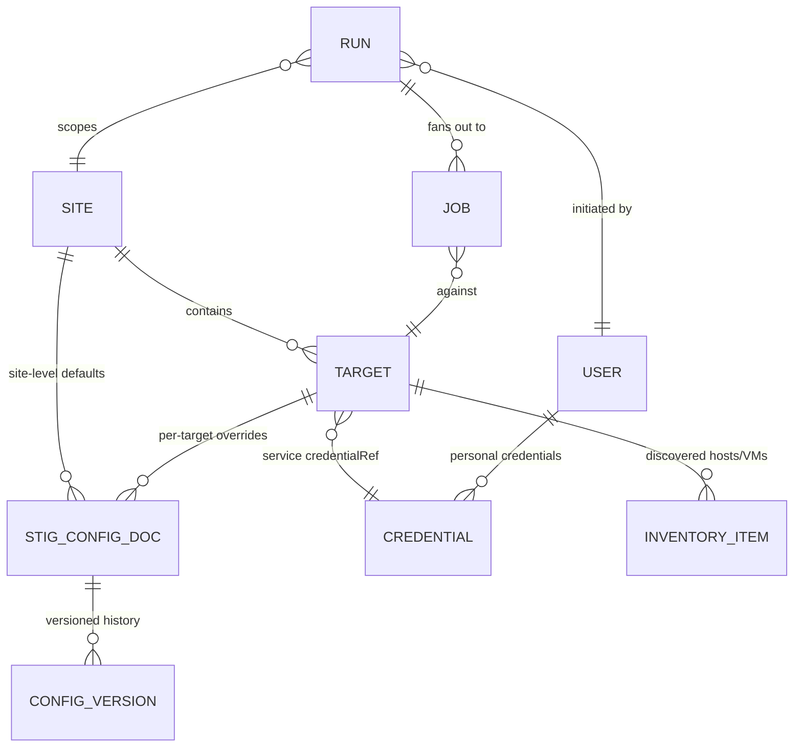

# Waypoint — Domain Model

Status: **draft, planning phase**. All example names are fictional placeholders
(`*.example.internal`, RFC 5737 addresses) — this is a public repository.

## Core entities

### Site
The top-level grouping — roughly "an enclave's VMware estate." A site contains
**targets of several kinds, with multiples allowed per kind** (e.g. two vCenters).
Per-site STIG configuration (attestations, inputs, remediation inputs) hangs off the
site, with per-target overrides. Maps closely to today's `site.json` schema 2.0 rows.

### Target
A scannable/manageable endpoint within a site. Kinds (from the existing catalog/router):

| Kind | Examples | Notes |
|---|---|---|
| `vsphere` | vCenter | multiple per site allowed; hosts/VMs discovered from it |
| `nsx-api` | NSX Manager | API transport |
| `ssh` (SRG) | Photon, Aria Operations, Aria Lifecycle, vIDM | HDF-only scans |

Each target references a **service credential** (`credentialRef`, as today). Discovered
ESXi hosts and VMs are cached inventory under a `vsphere` target, not standalone targets.

### Credential
An object in the encrypted store (see [ADR-0005](adr/0005-secrets.md)) with an
**owner**: a specific user (personal) or shared/system (service account). Targets
reference service credentials for scheduled/system runs; ad hoc runs may substitute the
initiating user's personal credential (so vCenter audit logs attribute actions to the
human). "One global service account" is just the degenerate case where every target
references the same credential — the model does not assume it.

Write-only through the API: a credential can be overwritten or deleted, never read back.

### Run and Job
A **Run** is what a user initiates ("scan site A, products X/Y, these 14 hosts"). The
job engine fans it out into **Jobs** (one per target/component), each carrying priority,
state, logs, and results. Job types: `scan`, `remediate`, `discover`, `download`,
`catalog-index`, `bundle-export`, `bundle-import`, `content-library-sync`, `update`.

Per-target scan states: `queued → running → attesting → converting → uploaded | done | failed`.

### STIG configuration documents
SAF attestation YAML, InSpec input YAML, remediation input files — stored as **documents
in Postgres** (not parsed into forms; the schemas belong to Broadcom/MITRE and change
under us). Scoped per site + per component, with per-target overrides. Edited in a
code-editor pane with validation. **Every save creates a version with author +
timestamp** — "who changed the attestation that waived this finding" is an auditor
question the tool must answer.

### STIG Manager connection
Global default connection, optional per-site override (different enclaves may report to
different STIG Manager instances).

## Roles

| Role | Capabilities |
|---|---|
| **Viewer** | Read-only: dashboards, runs, results |
| **Cyber** | Viewer + **initiate scans** (using the target's assigned service credential) + export results + full audit history. No config, credentials, downloads, or remediation. |
| **Operator** | Cyber + ad hoc scans with **their own** stored credentials + download/catalog/content-library management |
| **Admin** | Everything: sites, targets, shared credentials, users/roles, STIG config, remediation, updates, transfer |

Rationale notes:

- Scans are read-only *in effect* (InSpec does log into systems and run commands, but
  changes nothing), which is why Cyber may initiate them with service credentials and
  why they are schedulable.
- **Remediation is never schedulable**, always requires typed confirmation
  (`REMEDIATE`, as today), and is never available to Viewer/Cyber.
- Use of **shared/service credentials for anything that writes** is an Admin capability.

## Scheduling

Scheduled runs (scans and other read-only job types only) execute under the target's
service credential and record "scheduled" as the initiator alongside the schedule's
creator. Remediation, bundle import/apply, and updates are excluded from scheduling by
design, not by configuration.

## Open questions (to resolve before build)

1. **Operator remediation**: may an Operator remediate using their *personal*
   credential, or is remediation strictly Admin? (Current lean: Admin-only in v1;
   revisit if it creates workflow friction.)
2. **Cyber scan scope**: can Cyber scope a scan to arbitrary host/VM subsets, or only
   run site/product-level scans as configured?
3. **Retention**: how long do run logs/results live in Postgres before pruning/archival
   (CKL/HDF artifacts may also live on disk under `/reports` as today)?
4. **Inventory staleness policy**: hard max age before a scan forces re-discovery?
