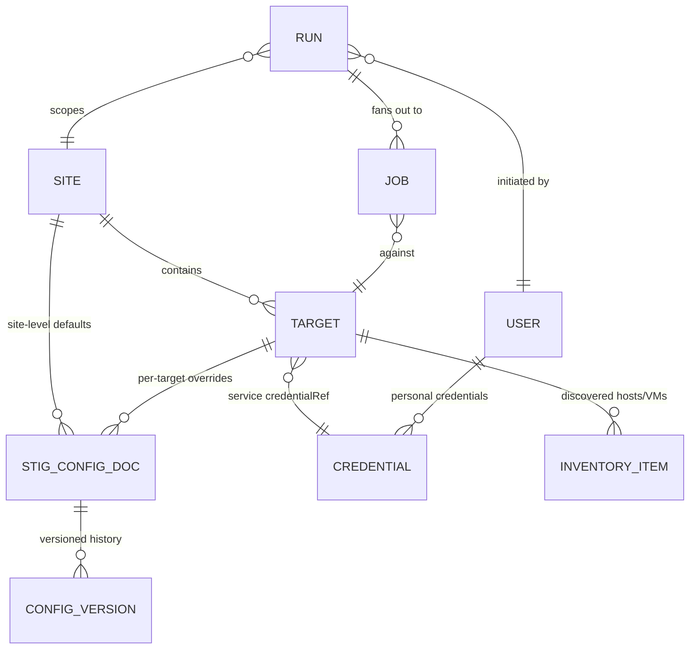

# Waypoint — Domain Model

Status: **living domain model**. All example names are fictional placeholders
(`*.example.internal`, RFC 5737 addresses) — this is a public repository.

## Core entities

### Site
The top-level grouping — roughly "an enclave's VMware estate." A site contains
**targets of several kinds, with multiples allowed per kind** (e.g. two vCenters).
STIG configuration resolves through three layers — **Global → Site → Target**, most
specific wins (see STIG configuration documents below). Maps closely to today's
`site.json` schema 2.0 rows.

### Target
A scannable/manageable endpoint within a site. Kinds (from the existing catalog/router):

| Kind | Examples | Notes |
|---|---|---|
| `vsphere` | vCenter | multiple per site allowed; hosts/VMs discovered from it |
| `nsx-api` | NSX Manager | API transport |
| `ssh` (SRG) | Photon, Aria Operations, Aria Lifecycle, vIDM | HDF-only scans |

Each target references a **service credential** (`credentialRef`, as today). Discovered
ESXi hosts and VMs are cached inventory under a `vsphere` target, not standalone targets.

### Credential
Two tiers ([ADR-0011](adr/0011-credential-tiers.md)):

- **Service/shared** — stored in the encrypted store ([ADR-0005](adr/0005-secrets.md)),
  decryptable autonomously for scheduled/system runs. Targets reference these via
  `credentialRef`. "One global service account" is just the degenerate case where
  every target references the same credential — the model does not assume it.
- **Personal** — **never a row in the reusable credential store**. An ad hoc run using
  "my credentials" prompts the user at run initiation; the value is envelope-encrypted
  into a separate, run-scoped `run_secrets` row (one per run, referenced by that run's
  jobs) so vCenter audit logs attribute actions to the human, a dedicated runner can
  decrypt it at the point of use, and an API restart between run creation and job claim
  does not force credential re-entry (issue #434). The row is terminal/expiry
  bounded: the backend deletes it the moment the run reaches a terminal state
  (completed, completed_with_failures, aborted), and a cleanup sweep removes any that
  outlive a bounded expiry window (an abandoned/crashed run). See
  [security.md](security.md) for the threat model this replaces.

Stored credentials are write-only through the API: overwrite or delete, never read
back. Threat model and leakage controls: [security.md](security.md).

### Run and Job
A **Run** is what a user initiates ("scan site A, products X/Y, these 14 hosts"). The
job engine fans it out into **Jobs** (one per target/component), each carrying priority,
state, logs, and results. Job types: `scan`, `remediate`, `discover`, `download`,
`catalog-index`, `bundle-export`, `bundle-import`, `content-library-sync`,
`content-pull`, `content-import`, `update`.

The API creates jobs but does not execute them. The long-lived `compliance-runner`
claims compliance job types and the `download-runner` claims download/content job
types directly from Postgres. The claiming runner owns the lease, heartbeat,
cancellation checks, stage transitions, events, and terminal state. See
[ADR-0013](adr/0013-control-plane-and-runners.md) and
[ADR-0014](adr/0014-runner-job-ownership.md).

Per-target scan states: `queued → running → attesting → converting → uploaded | done |
failed | auth-failed | blocked`.

Run behaviors (from the UI prototype reconciliation, now backend requirements):

- **Auth-failure queue halt**: N consecutive `auth-failed` results (default 3) against
  the same credential halt that priority queue (`blocked`) instead of continuing —
  hammering a failing service account locks it out of AD. An Admin can swap the
  credential and resume, which re-queues the blocked targets.
- **Run controls**: pause queue (stop dispatching, let in-flight finish) and abort run.
- Backend keeps the **six** catalog-declared priorities (NSX=1 … VM=5, SRG=6); the UI
  may group VM+SRG visually, but the priority column is six-valued.

### STIG configuration documents
SAF attestation YAML, InSpec input YAML, remediation input files — stored as **documents
in Postgres** (not parsed into forms; the schemas belong to Broadcom/MITRE and change
under us). Edited in a code-editor pane with validation. **Every save creates a version
with author + timestamp** — "who changed the attestation that waived this finding" is
an auditor question the tool must answer.

Content model (refined by the UI design pass):

- **InSpec profiles** (from the compliance-content repo) are the unit of execution. A
  profile is either **STIG-backed** (married to an XCCDF benchmark synced from STIG
  Manager or uploaded) or an **SRG** profile with no published STIG — SRG profiles
  still take inputs and attestations.
- **Inputs** are values the scan needs to evaluate controls (syslog host, NTP list).
  **Attestations** are waivers applied after the fact. **Remediation inputs** control
  what a remediation run may change.
- All three resolve through three layers — **Global → Site → Target**, most specific
  wins. A lower layer may set a genuinely *different* value; it is not a tighten-only
  relationship.
- **Expired attestations are not applied**: the control reports Open, the run logs a
  WARN, and Results lists expired attestations explicitly. A lapsed waiver must never
  be applied silently.

### Compliance content (the profiles repo)
The VMware DoD compliance-and-automation repo is managed appliance state, not a manual
mount: pinned tag or tracked branch, recorded commit, last-pull author/time, profile
inventory. Connected instances pull (`content-pull`); air-gapped instances import
content bundles (`content-import`) carried by the transfer format.

### Appliance build and transfer state

Waypoint is distributed as source, Dockerfiles, and Compose definitions. Operators
build the appliance images locally. Account-gated vendor tools are acquired through
the UI from an authorized upstream, local repository, or manual upload and stored in
persistent managed appliance state; they are not published by the Waypoint project.

An operator-created air-gap bundle includes all tools, content, and other payloads
required for the selected appliance functions. Until the updater/exporter is built,
the operator separately exports the locally built images and transfers them. The
future exporter may include those images in the signed transfer package; importing a
newer image set stages an available appliance update, and applying it remains an
explicit Admin action. See [ADR-0015](adr/0015-source-build-and-operator-export.md).

### STIG Manager connection
Global default connection, optional per-site override (different enclaves may report to
different STIG Manager instances).

## Roles

| Role | Capabilities |
|---|---|
| **Viewer** | Read-only: dashboards, runs, results |
| **Cyber** | Viewer + **initiate scans** (using the target's assigned service credential) + export results + full audit history. No config, credentials, downloads, or remediation. |
| **Operator** | Cyber + ad hoc scans entering **their own** credentials at run time ([ADR-0011](adr/0011-credential-tiers.md)) + download/catalog/content-library management |
| **Admin** | Everything: sites, targets, shared credentials, users/roles, STIG config, remediation, updates, transfer |

Rationale notes:

- Scans are read-only *in effect* (InSpec does log into systems and run commands, but
  changes nothing), which is why Cyber may initiate them with service credentials and
  why they are schedulable.
- **Remediation is Admin-only in v1** (decided 2026-08-02 at design reconciliation;
  revisit only if it creates real workflow friction). It is never schedulable and
  always requires typed confirmation (`REMEDIATE`, as today).
- Use of **shared/service credentials for anything that writes** is an Admin capability.
- UI treatment: actions a role cannot take are visible but disabled with a reason —
  never silently hidden. Mode-gating (air-gapped) is the opposite: absent features are
  removed.

## Scheduling

Scheduled runs (scans and other read-only job types only) execute under the target's
service credential and record "scheduled" as the initiator alongside the schedule's
creator. Remediation, bundle import/apply, and updates are excluded from scheduling by
design, not by configuration.

## Open questions (to resolve before build)

1. **Cyber scan scope**: can Cyber scope a scan to arbitrary host/VM subsets, or only
   run site/product-level scans as configured?
2. **Retention**: how long do run logs/results live in Postgres before pruning/archival
   (CKL/HDF artifacts may also live on disk under `/reports` as today)?

Resolved:

- ~~Inventory staleness policy~~ → **60-minute default, operator-configurable**
  (`Discovery:StaleAfterMinutes`, issue #21, 2026-08-08). Long enough that revisiting
  the Start-a-Scan screen minutes apart does not force a redundant `discover` job (a
  vSphere AllLinked connect + full enumeration is not free); short enough that a scan
  does not silently run against a tree that is hours stale. `GET
  /targets/{id}/inventory` reports a `stale` flag computed against this threshold; the
  caller decides whether to call `POST /targets/{id}/discover` first. This slice
  implements the threshold plus manual/on-demand refresh only — automatically
  triggering a refresh at scan-initiation time (this open question's other half) is
  deferred to land with the scan slice (#23), since the scan-initiation code path
  doesn't exist yet.
- ~~Operator remediation~~ → **Admin-only in v1** (2026-08-02).
- ~~Download-tool distribution~~ → **confirmed: the Waypoint project does not publish
  `vcf-download-tool` binaries** (clarified 2026-08-11). An authenticated operator can
  install the tool through the connected appliance UI from its authorized upstream;
  local-repository and verified manual-upload paths also remain valid. The installed
  tool is managed appliance state and travels in operator-created air-gap bundles so
  the disconnected appliance retains the selected functionality. See ADR-0015.
- ~~Depot index without the tool~~ → **confirmed: building the index does NOT require
  the download tool** (2026-08-08, issue #194). `catalog-index` calls
  `vcf-docker-download`'s `Get-FileManifest` (`vcf-download-manager.common.ps1`), which
  is a pure filesystem walk (`Get-ChildItem -Recurse` + optional `Get-FileHash`) over
  files already present on the depot share — it never shells out to
  `vcf-download-tool` or any other vendor binary, and takes no depot-token parameter at
  all. The adjacent vendor-catalog readers (`Get-VcsaLatestRelease` /
  `Get-VcsaCatalogPath`) are the same shape: they parse a local
  `productVersionCatalog.json` already on disk, not a live vendor call. The download
  tool (and the depot token) is only needed to *populate or refresh* depot content in
  the first place — a distinct, already-resolved concern (previous bullet) — not to
  read back what is already there. This is why `GET /catalog/artifacts` stays
  browsable with the tool absent, and why `catalog-index`'s depot-token parameter
  (threaded through under security.md controls 1/2 for forward compatibility with a
  future vendor-catalog-refresh addition) is accepted but unused by the indexing walk
  itself.
