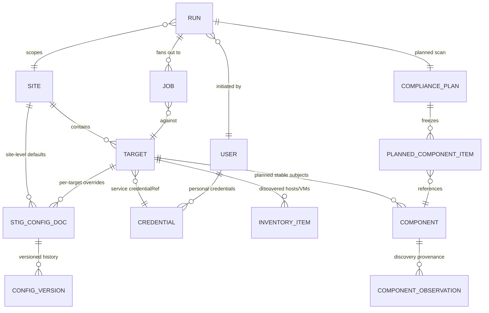

# Waypoint — Domain Model

Status: **living domain model**. All example names are fictional placeholders
(`*.example.internal`, RFC 5737 addresses) — this is a public repository.

## Core entities

### Site
The top-level grouping — roughly "an enclave's VMware estate." A site contains
**targets of several kinds, with multiples allowed per kind** (e.g. two vCenters).
STIG configuration resolves through three layers — **Global → Site → Target**, most
specific wins (see STIG configuration documents below). Maps closely to today's
`site.json` schema 2.0 rows.

### Target
An Admin-configured connection and policy boundary within a site. The shipped M2 slice
also treats it as the scannable endpoint. Kinds (from the existing catalog/router):

| Kind | Examples | Notes |
|---|---|---|
| `vsphere` | vCenter | multiple per site allowed; hosts/VMs discovered from it |
| `nsx-api` | NSX Manager | API transport |
| `ssh` (SRG) | Photon, Aria Operations, Aria Lifecycle, vIDM | HDF-only scans |

Each target references a **service credential** (`credentialRef`, as today). Discovered
ESXi hosts and VMs are cached inventory under a `vsphere` target, not standalone targets.

🚧 **Planned compliance inventory model (epic #726).** The paragraph above
describes the shipped M2 shortcut. In the planned model, `Target` remains the
Admin-configured connection/policy boundary; execution resolves stable `Component`
records beneath it. A directly configured appliance still has a component distinct
from its connection record.

### Compliance component and observation (planned)

`Component` is a durable inventory entity with:

- `target_id`, Waypoint catalog component key, and authoritative vendor identity;
- configured and discovered exact-version/capability facts, never a guessed merge;
- lifecycle `active | absent | retired`, first/last-seen and continuous-absence times;
- component-specific configuration retained across temporary absence; and
- immutable links from historical planned items, including after component purge.

The identity tuple is unique within its top-level target. Vendor managed-object or
product-native IDs are authoritative for discovery-backed objects. A component that
exists by catalog declaration rather than as its own upstream object uses the parent
target's durable identity plus catalog component key. Hostname, IP address, display
name, tree position, profile leaf/path, and sibling family key are never identity.

`ComponentObservation` is immutable provenance from one discovery boundary/pass:
source target/connection, upstream identity, observed exact version/build and other
catalog-declared facts, observed time, outcome, and raw-evidence digest/reference.
`ConfiguredComponentFact` records an Admin-supplied exact value with actor/time. Facts
may agree, be missing, or conflict; conflict is a first-class readiness failure, not a
precedence rule. Unknown components/facts remain visible but unsupported.

`DiscoveryRefresh` records trigger (`scheduled | pre-scan | manual`), target boundary,
start/end, success/failure, and completeness. The global Admin schedule defaults to
daily; a per-top-level-target Admin override wins. Each boundary reconciles only on a
complete success. Partial/failure preserves old observations as unverified and cannot
mark rows absent. On a complete boundary, a missing identity becomes `absent` while
retaining configuration. Continuous absence reaching the global Admin-configured
threshold (default seven days) becomes `retired`. Rediscovery before purge restores
the same record. Admin-only audited purge removes retired configuration but not
historical plan identity.

Maintenance mode is informational. It neither changes requested scope nor creates an
automatic exclusion.

### Compliance scope and plan (planned)

`RequestedScope` is immutable intent in exactly one mode:

- `all`: expand all compatible components beneath named top-level targets after the
  mandatory refresh; or
- `explicit`: the exact set of selected stable component identities.

`ResolvedScope` is the concrete identity set produced by that refresh plus resolution
time and provenance. `all` includes newly discovered compatible components; explicit
scope never widens. Missing, absent, retired, unreachable, unsupported, version-
conflicted, or baseline-unready selections are recorded as `CoverageOmission` with
identity, stage, and reason. An incomplete refresh boundary makes `all` unresolved;
it cannot masquerade as a smaller successful scan. Explicit selections must be
observed and reachable before any component job begins.

When configured and discovered exact versions conflict, a Cyber-or-higher interactive
initiator chooses one for only that run; both values/provenance and the choice are
frozen without mutating either source. A scheduled run cannot choose: it records that
component as a version-conflict omission, continues independent items, remains
enabled, and tries current facts at its next dispatch. Readiness requires one exact
catalog product-version match and exactly one active, approved compatible baseline.
Missing facts or baseline skip only that component; even an all-unsupported explicit
scope produces an honest zero-execution plan. There is no range, nearest-version,
family-key, or caller-profile fallback.

`CompliancePlan` freezes requested scope, resolved scope, refresh coverage, creator or
schedule provenance, and its `PlannedComponentItem` collection. Each item freezes:

- stable component/parent identity and configured/discovered fact provenance;
- exact catalog revision, product version, active baseline, profile/XCCDF/mapping and
  complete-dependency-closure identities/digests;
- catalog selector, transport, priority, output semantics, and compatibility result;
- the exact resolved-configuration snapshot identity/digest and references to
  credential, trust, and capability decisions whose contents are owned by #807/#808;
  and
- zero or more coverage omissions/readiness failures.

Plans/items and omissions are append-only. Later discovery, configuration, activation,
retirement, or purge cannot rewrite them. Retry uses the same planned item; resolving
current state creates a new run. Jobs and ordered attempts are separate execution
records defined by #807 rather than mutable plan fields.

**Credential purposes (design; not yet persisted — [ADR-0021](adr/0021-credential-purpose-matrix.md), issue #583).**
A single `credentialRef` per target is not enough: `vsphere` targets need a distinct
vSphere API credential and VCSA SSH credential, satisfiable independently. ADR-0021
defines four named purposes (never generic numbered slots) and which operations need
which:

| Purpose | Satisfying credential type | Meaning |
|---|---|---|
| `vsphere-api` | `vcenter` | vSphere SSO session (vCenter/ESXi/VM API access) |
| `vcsa-ssh` | `ssh` | VCSA appliance root SSH (VCSA OS-level components only) |
| `nsx-api` | `nsx` | NSX Manager REST API session |
| `srg-ssh` | `ssh` | SRG product SSH login (Photon/Aria Operations/Aria Lifecycle/vIDM), sudo-capable |

Target kind × operation → required/optional purposes:

| Target kind | Operation / component | Required | Optional |
|---|---|---|---|
| `vsphere` | discovery | `vsphere-api` | — |
| `vsphere` | credential-test (vCenter API) | `vsphere-api` | — |
| `vsphere` | credential-test (VCSA SSH) | `vcsa-ssh` | — |
| `vsphere` | scan: vCenter / ESXi / VM | `vsphere-api` | — |
| `vsphere` | scan: VCSA component(s) | `vsphere-api`, `vcsa-ssh` | — |
| `vsphere` | remediation-ready planning | `vsphere-api` | `vcsa-ssh` (required if plan includes a VCSA component) |
| `nsx-api` | credential-test, scan, remediation-ready planning | `nsx-api` | — |
| `ssh` (SRG) | credential-test, scan, remediation-ready planning | `srg-ssh` | — |

Discovery requires only `vsphere-api`, never `vcsa-ssh` (issue #580/PR #606 fixed a bug
where discovery and vSphere-API credential testing incorrectly prompted for a VCSA
credential). `nsx-api` and `ssh` targets have no discovery operation at all today (only
`vsphere` is inventory-capable). See ADR-0021 for defaulting, override, snapshot,
audit, missing-binding, and scheduling behavior. **This is a design-and-contracts
slice only** — #584 adds persistence, #585/#586 wire it into execution, #587 updates the
wizard UI; nothing consumes this matrix at runtime yet.

### Credential
Two tiers ([ADR-0011](adr/0011-credential-tiers.md)):

- **Service/shared** — stored in the encrypted store ([ADR-0005](adr/0005-secrets.md)),
  decryptable autonomously for scheduled/system runs. Targets reference these via
  `credentialRef`. "One global service account" is just the degenerate case where
  every target references the same credential — the model does not assume it.
- **Personal** — **never a row in the reusable credential store**. An ad hoc run using
  "my credentials" prompts the user at run initiation; the value is envelope-encrypted
  into a separate, run-scoped `run_secrets` row (one per run, referenced by that run's
  jobs) so vCenter audit logs attribute actions to the human, a dedicated runner can
  decrypt it at the point of use, and an API restart between run creation and job claim
  does not force credential re-entry (issue #434). The row is terminal/expiry
  bounded: the backend deletes it the moment the run reaches a terminal state
  (completed, completed_with_failures, aborted), and a cleanup sweep removes any that
  outlive a bounded expiry window (an abandoned/crashed run). See
  [security.md](security.md) for the threat model this replaces.

Stored credentials are write-only through the API: overwrite or delete, never read
back. Threat model and leakage controls: [security.md](security.md).

### Run and Job
A **Run** is what a user initiates ("scan site A, products X/Y, these 14 hosts"). The
job engine fans it out into **Jobs** (one per target/component), each carrying priority,
state, logs, and results. Job types: `scan`, `remediate`, `discover`, `credential-test`, `download`,
`catalog-index`, `bundle-export`, `bundle-import`, `content-library-sync`,
`content-pull`, `content-import`, `update`.

The API creates jobs but does not execute them. The long-lived `compliance-runner`
claims compliance job types and the `download-runner` claims download/content job
types directly from Postgres. The claiming runner owns the lease, heartbeat,
cancellation checks, stage transitions, events, and terminal state. See
[ADR-0013](adr/0013-control-plane-and-runners.md) and
[ADR-0014](adr/0014-runner-job-ownership.md).

Per-target scan states: `queued → running → attesting → converting → uploaded | done |
failed | auth-failed | blocked`.

Run behaviors (from the UI prototype reconciliation, now backend requirements):

- **Auth-failure queue halt**: N consecutive `auth-failed` results (default 3) against
  the same credential halt that priority queue (`blocked`) instead of continuing —
  hammering a failing service account locks it out of AD. An Admin can swap the
  credential and resume, which re-queues the blocked targets.
- **Run controls**: pause queue (stop dispatching, let in-flight finish) and abort run.
- Backend keeps the **six** catalog-declared priorities (NSX=1 … VM=5, SRG=6); the UI
  may group VM+SRG visually, but the priority column is six-valued.

Run/Job records are the **operational history**, not universal ownership of the
objects produced by work. They retain type, actor and target/context attribution,
state, timing, and redacted event/log diagnostics. Durable outputs belong to domains:

| Job family | Durable output owner |
|---|---|
| `scan`, `remediate` | Compliance Results: findings, attestations, remediation state, CKL/HDF artifacts |
| `discover`, `credential-test` | Targets: current inventory and connection status |
| `download`, `catalog-index`, `content-library-sync` | Catalog/Library: catalog state and downloaded content |
| `content-pull`, `content-import` | Compliance Content: repo/profile inventory |
| `bundle-export`, `bundle-import` | Transfer: bundle manifests and apply state |
| `update` | System administration: staged/applied update state |

Live Jobs and generic history may link to these objects but do not duplicate their
management actions. Removing operational history cannot implicitly delete a domain
object; destructive domain cleanup is separately authorized, audited, and retryable
([ADR-0019](adr/0019-global-job-observability.md)). Retention duration for both layers
remains an operator-policy decision.

#### Operational vs. domain retention ownership (issue #592, epic #588's last child)

Every closed-set `run_type`/`job_type` classified by what it retains where, and who is
authorized to delete which layer. "Operational metadata" is always the `runs`/`jobs`
rows themselves plus their `job_events` diagnostics — retained for **every** type,
because `job_events` is append-only-by-trigger and FK'd to `jobs` with no cascade
action (migration 0001/0020), the same structural reason both `purged_at`
(migration 0042) and `history_deleted_at` (migration 0046) mark a run's row in place
rather than deleting it. "Domain outputs" is what a type's handler durably writes
outside the job engine. "Generic deletion" is `DELETE /runs/{id}/history` (this issue);
"domain purge" is `POST /runs/{id}/purge` (issue #594, `scan`/`remediate` only — no
other type has a domain-purge operation today, so generic deletion applies to them
directly once terminal).

| `run_type`/`job_type` | Operational metadata | Domain outputs | Retention owner | Generic deletion gate |
|---|---|---|---|---|
| `scan`, `remediate` | run/job rows, `job_events`, `attestation_snapshots` while unpurged | Compliance Results: findings, attestations-applied ledger, CKL/HDF artifact files | Compliance Results (`RunPurgeService`) | **Requires `runs.purged_at` set first** (409 `requires_domain_purge_first` otherwise) — see below |
| `discover`, `credential-test` | run/job rows, `job_events` | Targets: `discovery_status`/`last_refreshed`, connection health (invented example: a target's discovered vSphere version) | Targets screen (mutated in place per target, never deleted by run history) | None — deletes directly once terminal |
| `download` | run/job rows, `job_events`, `run_secrets` (already swept at terminal) | Catalog/Library: downloaded artifact files, `downloads`/`depot_artifacts` rows (invented example: a fetched VCF ISO) | Library/Catalog screens | None — deletes directly once terminal |
| `tool-install` | run/job rows, `job_events`, `tool-upload-staging` files (already consumed/cleaned at install time) | Downloads: `managed_tool_installs` ledger rows (append-only by trigger; invented example: a rejected-signature install attempt) and the activated tool binary in the managed-tool store | Depot & Tokens screen (install history; ledger is never deleted by run-history cleanup) | None — deletes directly once terminal; the install ledger and tool binary are untouched |
| `catalog-index`, `content-library-sync` | run/job rows, `job_events` | Catalog/Library: synced catalog metadata rows | Library/Catalog screens | None — deletes directly once terminal |
| `content-pull`, `content-import` | run/job rows, `job_events` | Compliance Content: `profiles`/`profile_controls` rows (invented example: an imported STIG benchmark's control list) | Compliance Content screen | None — deletes directly once terminal |
| `bundle-export`, `bundle-import` | run/job rows, `job_events` | Transfer: bundle manifest/apply-state rows (invented example: a signed export bundle's manifest) | Transfer screen | None — deletes directly once terminal |
| `update` | run/job rows, `job_events` | System administration: staged/applied update state (invented example: a recorded appliance version bump) | System screen | None — deletes directly once terminal |
| `purge` | run/job rows, `job_events` (the purge-wrapper run migration 0042 creates, `initiated_by = "purge:<actor>"`) | None — this run type has no domain output of its own; it is the mechanism that deletes another run's | N/A (never independently purged/deleted; it is retained exactly like any other terminal run's history) | None — deletes directly once terminal, same as any non-compliance type |

**The compliance gate, precisely.** `RunHistoryDeletionService.DeleteHistoryAsync`
checks `run_type IN ('scan', 'remediate')`; if true, it additionally requires
`runs.purged_at IS NOT NULL` (i.e., `POST /runs/{id}/purge` already completed for that
run) before it will set `runs.history_deleted_at`. This is the concrete form of epic
#588's design principle: "generic cleanup DEFERS to domain purge when compliance-owned
artifacts are involved" — the operational history for a scan/remediate run is not
deletable while its findings/attestations/artifacts might still exist, because an
operator reading `GET /runs/{id}/history` after a bare history deletion would otherwise
see no record that a run *ever* produced those still-present compliance artifacts. No
other run type has this ordering requirement, since none of them has a domain-purge
operation to defer to — their durable outputs are mutated/replaced in place by later
runs of the same job type (a target's `discovery_status` is overwritten, not versioned
per run) rather than being a la carte deletable per run.

**What generic deletion actually deletes**, for every type: nothing at the row level
beyond marking `runs.history_deleted_at` and severing `schedules.last_run_id` if this
run was a schedule's most-recent-run pointer (the same "FK is a backstop, not the
enforcement point" idiom `purged_at`'s schedule-nulling already established). The run,
job, and `job_events` rows are retained — see migration 0046's header comment for why
that is structural, not a policy choice. An append-only `run_history_deletion_tombstones`
row records actor/time/prior-state/outcome, mirroring `run_purge_tombstones`'s shape as
a deliberate sibling (not a shared table — see that migration for why).

**Roll-off (issue #708, epic #706)** is a configurable, disabled-by-default periodic
sweep (`RunHistoryRolloffHostedService`) that calls `RunHistoryDeletionService.DeleteHistoryAsync`
— the exact operation described above, unmodified — for terminal runs older than a
configured age whose generic deletion gate is already `None` in the table below. It
reuses this classification table's gate column as its own eligibility rule rather than
defining a second one: `scan`/`remediate` are excluded from the sweep's candidate query
outright (not merely deferred like the interactive endpoint's 409), because epic #706's
design is that compliance-run history is *windowed out of default views, never
auto-deleted* — windowing (a frontend default-view time filter) and deletion remain
independent operations for that gate; an Admin's explicit `DELETE /runs/{id}/history`
call after purge is unaffected. Every other type in the table below (`None` gate) is
eligible once terminal and aged, identically to what an Admin could already do by hand
via the same endpoint.

### STIG configuration documents
SAF attestation YAML, InSpec input YAML, remediation input files — stored as **documents
in Postgres** (not parsed into forms; the schemas belong to Broadcom/MITRE and change
under us). Edited in a code-editor pane with validation. **Every save creates a version
with author + timestamp** — "who changed the attestation that waived this finding" is
an auditor question the tool must answer.

Content model (refined by the UI design pass):

- **InSpec profiles** (from the compliance-content repo) are the unit of execution. A
  profile is either **STIG-backed** (married to an XCCDF benchmark synced from STIG
  Manager or uploaded) or an **SRG** profile with no published STIG — SRG profiles
  still take inputs and attestations.
- **Inputs** are values the scan needs to evaluate controls (syslog host, NTP list).
  **Attestations** are waivers applied after the fact. **Remediation inputs** control
  what a remediation run may change.
- All three resolve through three layers — **Global → Site → Target**, most specific
  wins. A lower layer may set a genuinely *different* value; it is not a tighten-only
  relationship.
- **Expired attestations are not applied**: the control reports Open, the run logs a
  WARN, and Results lists expired attestations explicitly. A lapsed waiver must never
  be applied silently.

### Compliance content (the profiles repo)
The VMware DoD compliance-and-automation repo is managed appliance state, not a manual
mount: pinned tag or tracked branch, recorded commit, last-pull author/time, profile
inventory. Connected instances pull (`content-pull`); air-gapped instances import
content bundles (`content-import`) carried by the transfer format.

### Appliance build and transfer state

Waypoint is distributed as source, Dockerfiles, and Compose definitions. Operators
build the appliance images locally. Account-gated vendor tools are acquired through
the UI from an authorized upstream, local repository, or manual upload and stored in
persistent managed appliance state; they are not published by the Waypoint project.

An operator-created air-gap bundle includes all tools, content, and other payloads
required for the selected appliance functions. Until the updater/exporter is built,
the operator separately exports the locally built images and transfers them. The
future exporter may include those images in the signed transfer package; importing a
newer image set stages an available appliance update, and applying it remains an
explicit Admin action. See [ADR-0015](adr/0015-source-build-and-operator-export.md).

### STIG Manager connection
Global default connection, optional per-site override (different enclaves may report to
different STIG Manager instances).

## Roles

| Role | Capabilities |
|---|---|
| **Viewer** | Read-only: dashboards, runs, results |
| **Cyber** | Viewer + **initiate scans** (using the target's assigned service credential) + export results + full audit history. No config, credentials, downloads, or remediation. |
| **Operator** | Cyber + ad hoc scans entering **their own** credentials at run time ([ADR-0011](adr/0011-credential-tiers.md)) + download/catalog/content-library management |
| **Admin** | Everything: sites, targets, shared credentials, users/roles, STIG config, remediation, updates, transfer |

Rationale notes:

- Scans are read-only *in effect* (InSpec does log into systems and run commands, but
  changes nothing), which is why Cyber may initiate them with service credentials and
  why they are schedulable.
- **Remediation is Admin-only in v1** (decided 2026-08-02 at design reconciliation;
  revisit only if it creates real workflow friction). It is never schedulable and
  always requires typed confirmation (`REMEDIATE`, as today).
- Use of **shared/service credentials for anything that writes** is an Admin capability.
- UI treatment: actions a role cannot take are visible but disabled with a reason —
  never silently hidden. Mode-gating (air-gapped) is the opposite: absent features are
  removed.

## Scheduling

Scheduled runs (scans and other read-only job types only) execute under the target's
service credential and record "scheduled" as the initiator alongside the schedule's
creator. Remediation, bundle import/apply, and updates are excluded from scheduling by
design, not by configuration.

## Open questions (to resolve before build)

1. **Cyber scan scope**: can Cyber scope a scan to arbitrary host/VM subsets, or only
   run site/product-level scans as configured?
2. **Retention**: how long do run logs/results live in Postgres before pruning/archival
   (CKL/HDF artifacts may also live on disk under `/reports` as today)?

Resolved:

- ~~Inventory staleness policy~~ → **60-minute default, operator-configurable**
  (`Discovery:StaleAfterMinutes`, issue #21, 2026-08-08). Long enough that revisiting
  the Start-a-Scan screen minutes apart does not force a redundant `discover` job (a
  vSphere AllLinked connect + full enumeration is not free); short enough that a scan
  does not silently run against a tree that is hours stale. `GET
  /targets/{id}/inventory` reports a `stale` flag computed against this threshold; the
  caller decides whether to call `POST /targets/{id}/discover` first. This slice
  implements the threshold plus manual/on-demand refresh only — automatically
  triggering a refresh at scan-initiation time (this open question's other half) is
  deferred to land with the scan slice (#23), since the scan-initiation code path
  doesn't exist yet.
- ~~Operator remediation~~ → **Admin-only in v1** (2026-08-02).
- ~~Download-tool distribution~~ → **confirmed: the Waypoint project does not publish
  `vcf-download-tool` binaries** (clarified 2026-08-11). An authenticated operator can
  install the tool through the connected appliance UI from its authorized upstream;
  local-repository and verified manual-upload paths also remain valid. The installed
  tool is managed appliance state and travels in operator-created air-gap bundles so
  the disconnected appliance retains the selected functionality. See ADR-0015.
- ~~Depot index without the tool~~ → **confirmed: building the index does NOT require
  the download tool** (2026-08-08, issue #194). `catalog-index` calls
  `vcf-docker-download`'s `Get-FileManifest` (`vcf-download-manager.common.ps1`), which
  is a pure filesystem walk (`Get-ChildItem -Recurse` + optional `Get-FileHash`) over
  files already present on the depot share — it never shells out to
  `vcf-download-tool` or any other vendor binary. The adjacent vendor-catalog readers
  (`Get-VcsaLatestRelease` / `Get-VcsaCatalogPath`) are the same shape: they parse a
  local `productVersionCatalog.json` already on disk, not a live vendor call. The
  download tool (and the Activation Code that authenticates it) is only needed to
  *populate or refresh* depot content in the first place — a distinct, already-resolved
  concern (previous bullet) — not to read back what is already there. This is why
  `GET /catalog/artifacts` stays browsable with the tool absent, and why issue #690
  removed `CatalogIndexJobHandler`'s credential resolution/decrypt entirely rather than
  merely leaving it unused: the handler now resolves NO credential of any kind
  (`depot-activation-code`, `legacy-download-token`, or the deprecated `depot-token`
  alias). `Invoke-WaypointCatalogIndex`'s `-DepotToken` parameter stays on the module
  signature, optional and unbound by the C# handler, for forward compatibility with a
  future vendor-catalog-refresh addition — the module itself still never reads it for
  the indexing walk.
