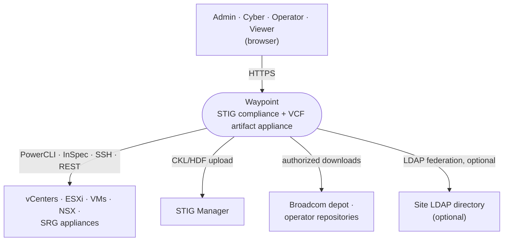
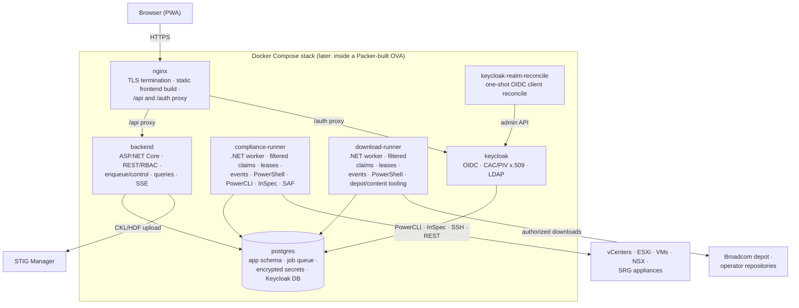
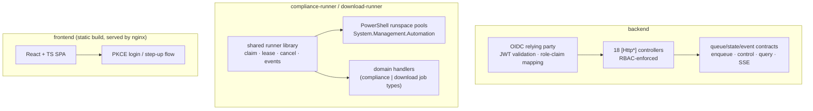

# Waypoint — System Architecture

Kind: explanation

Status: **living document, approved architecture ahead of implementation** (the seven closed
delivery stories — milestones 3–9 — are built; the open stories are design intent until
their domain epics land — see [`roadmap.md`](roadmap.md)). This describes the
target-state system; decisions are recorded as ADRs in [`adr/`](../adr/). Sections below
are marked ✅ **Built** (shipped by a closed delivery story — the section names
which; the full list of stories and their epics is in [`roadmap.md`](roadmap.md)),
🚧 **In transition** (approved replacement is not yet implemented), or
📋 **Planned** (later stories) so a reader can tell what exists from what is still design intent.
Do not read a 📋 marker as license to change the described design without an ADR.

## Context

A self-hosted web appliance that unifies VMware STIG compliance
([vmware-stig-docker](https://github.com/blac9216/vmware-stig-docker)) and VCF artifact
download/repository management
([vcf-docker-download](https://github.com/blac9216/vcf-docker-download)) for DoD-style
environments. Project-owned Dockerfiles, orchestration, and PowerShell from the two
predecessor repositories migrate into dedicated execution runners. Waypoint's
**control plane** is the UI/API, credential store, RBAC, job control, history/SSE, and
cross-enclave transfer; it does not execute domain tools (ADR-0013).

Users — Admin, Cyber, Operator, Viewer ([domain-model.md](domain-model.md)) — reach the
appliance over HTTPS through a browser; there is no other client. Waypoint in turn reaches
the compliance targets it scans/remediates, the STIG Manager instance it uploads evidence
to, the Broadcom depot and operator repositories it pulls VCF artifacts from, and,
optionally, a site LDAP directory Keycloak federates identity from
([ADR-0004](../adr/0004-identity-keycloak.md)).

## Container

✅ **Built**: nginx, Postgres, the STIG Manager connection (foundation and scan-slice
stories), the split of the once-combined backend into a control-plane API plus dedicated
`compliance-runner` and `download-runner` services (ADRs 0013/0014, issue #443) — the
API process references neither the PowerShell SDK nor any job handler at build time
(`backend/Waypoint.Infrastructure.Execution` is a separate project only the two runners
reference) — and Keycloak as the IdP (*Identity, RBAC & scheduling*, epic #14): its own
Postgres database, scripted realm bootstrap, and OIDC bearer-token validation/PKCE login
wired through nginx and the backend. `keycloak-realm-reconcile` is a one-shot container
that runs on every `up` to force-update the OIDC clients' redirect/origin settings to the
current public URL, independent of whether Keycloak's own `--import-realm` ran this boot.
📋 **Planned**: updater/exporter and transfer automation (*Transfer & enclave modes* /
*Self-update & appliance packaging*) — not yet a compose service.

There is no standalone `frontend` container: nginx's image build copies the React/TS PWA's
static bundle in at build time and serves it directly, alongside terminating TLS and
proxying `/api` to the backend and `/auth` to Keycloak.

Every container name below is a `deploy/compose.yaml` service name.

## Component

Inside the backend, the runners, and the frontend build — the level below "which
container" is "which component owns this responsibility."

**backend (ASP.NET Core API).** A plain OIDC relying party performing JWT bearer
validation with canonical-issuer pinning ([ADR-0004](../adr/0004-identity-keycloak.md),
issue #842) and fail-closed role-claim mapping, enforced on every `[Http*]`-decorated
action across all 18 controllers, closed out by a reflection-driven endpoint × role
matrix test. It owns the durable job queue/state/event contracts — enqueue, control,
query, migrations, and the SSE feed the UI reads from persisted events — but hosts no
dispatcher, no PowerShell, and no domain handler: execution ownership belongs entirely to
the two runners (ADRs 0013/0014). `Waypoint.Infrastructure.Execution` is a separate
project only `compliance-runner` and `download-runner` reference, so the API cannot
accidentally pull in PowerShell or a handler at build time.

**compliance-runner and download-runner (.NET workers).** A shared C# runner library is
the generic orchestrator — job claiming (`SELECT … FOR UPDATE SKIP LOCKED`), leases,
cooperative cancellation, and structured event writes direct to Postgres — common to
both; domain handlers and PowerShell modules are the adaptable workers underneath it
([ADR-0008](../adr/0008-job-engine.md)). Each runner hosts its own PowerShell runspace
pools in-process through `System.Management.Automation`, with handler-specific options in
`IOptions<PowerShellOptions>` (`Waypoint.Core.PowerShell.PowerShellOptions`). Remediation
may keep child-`pwsh` isolation for code that calls `Exit`. `compliance-runner` claims
only compliance job types (discovery/scan/NSX/SRG) and drives PowerCLI/InSpec/SAF against
target infrastructure; `download-runner` claims only download job types and drives the
depot/content-library tooling against the Broadcom depot and operator repositories.

**frontend (static PWA build).** A React + TypeScript single-page app, built once into
nginx's image and served as a static bundle — not its own runtime container. It runs a
hand-rolled authorization-code + PKCE login flow (no external OIDC libraries) against
Keycloak through nginx's `/auth` proxy, and re-runs that flow with
`prompt=login`/`max_age=0` for step-up re-authentication on sensitive actions such as
overwriting a stored credential's secret.

## Deployment topology: one appliance, two modes

📋 **Planned (*Transfer & enclave modes*, epic [#17](https://github.com/blac9216/waypoint/issues/17)).** Today
there is one mode: a single connected-style dev/compose deployment, now with Keycloak
OIDC as the production sign-in path (*Identity, RBAC & scheduling*). Mode enforcement, the disconnected variant,
and transfer bundles are not yet built.

The same operator-built Compose topology deploys on both sides of the air gap
([ADR-0010](../adr/0010-deployment-topology.md), [ADR-0015](../adr/0015-source-build-and-operator-export.md)):

| | Connected instance | Disconnected instances |
|---|---|---|
| Internet | Yes (Broadcom depot reachable) | No |
| STIG scan / remediate | ✅ | ✅ |
| Download manager / catalog browser | ✅ | Hidden/disabled |
| Transfer | **Builds** signed export bundles | **Imports** and validates bundles |
| Updates | Optional online check + bundle upload | Bundle upload only |

The mode is instance configuration, surfaced as a persistent badge in the UI. Feature
availability derives from the mode — there is one codebase and one image, never a fork.

## The job engine (the heart of the product)

✅ **Built** (foundation and scan-slice stories, ADRs 0013/0014, issue #443): queue, dispatcher, priority,
in-process PowerShell runspace hosting, SSE streaming, and the per-target state
machine below are live, serving `catalog-index`/`download` (foundation story, the
latter now retirement-planned — see "Depot, catalog, and download management" below,
[ADR-0030](../adr/0030-retire-legacy-download-job-type.md)) and discovery/scan/
NSX/SRG job types (scan-slice story). Cooperative per-job cancellation (issue #234) and
lease-recovery sweeps also shipped. Execution ownership is now the two long-lived
runners' alone: each runner atomically claims only its allowlisted job types, owns the
lease and cancellation for work it executes, and writes structured events directly to
Postgres. `Waypoint.Api` retains the durable queue/state/event contracts —
enqueue/control/query, migrations, and the SSE feed the UI reads from persisted
events — but hosts no dispatcher, no PowerShell, and no domain handler. Scheduling
(cron-style, read-only job types only, per-job-type minimum-role floors) is ✅ **built**
(*Identity, RBAC & scheduling*, epic #14).

Everything long-running is a **job**: a scan of a site, a remediation of a component, an
artifact download, an inventory discovery, a bundle export/import, a catalog index. One
engine serves both products and all future features ([ADR-0008](../adr/0008-job-engine.md)).

- **Queue**: Postgres table claimed with `SELECT … FOR UPDATE SKIP LOCKED`. No Redis or
  message broker at this scale.
- **Priority**: carried over from the STIG catalog's declared `reportGroup`/`priority`
  model (NSX=1, VCSA=2, vCenter=3, ESXi=4, VM=5, SRG=6) as a priority column; other job
  types declare their own.
- **Execution**: each .NET runner hosts its own PowerShell runspace pools in-process
  through `System.Management.Automation`; real objects flow between C# handlers and
  PowerShell without a network/stdout protocol. Remediation may keep child-`pwsh`
  isolation for code that calls `Exit`. Handler-specific runner options live in
  `IOptions<PowerShellOptions>` (`Waypoint.Core.PowerShell.PowerShellOptions`,
  configuration section `PowerShell`, env var prefix `PowerShell__…`) alongside the
  general pool settings (`MaxRunspaces`, `DefaultInvocationTimeout`,
  `StopGracePeriod`) — e.g. `DiscoveryDnsTimeoutMilliseconds` (issue #1305, default
  3000) bounds every DNS lookup `WaypointDiscovery.psm1` performs while resolving
  the vCenter session identity; `DiscoverJobHandler` threads it to
  `Invoke-WaypointDiscovery -DnsTimeoutMilliseconds`, and a lookup that exceeds it
  emits a job.log warning naming the lookup kind and host rather than silently
  degrading to "no match". Accepted range 100–60000 ms, validated on start
  (`ValidateDataAnnotations`/`ValidateOnStart`): the option's only job is to bound a
  hang, and the values just outside that range defeat it silently — `-1` is
  `Timeout.Infinite`, `-2` and below throw into the module's fail-open catch — so the
  runner refuses to start rather than accept one.
- **Concurrency**: a shared runner library reads container CPU/memory limits, combines
  them with measured handler resource profiles and operator caps, and admits work only
  within that budget. Exact weights/defaults await measurement. Queue/worker identity
  is replica-safe, but Compose starts one of each runner.
- **Streaming**: per-job log and state events go to the UI over SSE (WebSocket if SSE
  proves insufficient). Logs and results also persist to Postgres for history.
- **State machine** (per target within a run): `queued → running → attesting →
  converting → uploaded | done | failed`. Failures never halt the run (Continue
  strategy, inherited from the STIG runner).
- The shared C# runner library is the generic orchestrator; domain handlers and
  PowerShell modules are adaptable workers. A future execution domain adds a runner
  host/image and handler registrations rather than changing the API/queue protocol.

### Operational projection and domain results

The common engine has a global **Live Jobs** projection over every active run/job.
It groups concurrent jobs by run and delegates the selected detail to a job-type
renderer; the selected item does not constrain runner concurrency. The existing
global SSE stream drives appliance-wide activity, while per-run streams drive the
selected run and bounded persisted-event queries provide completed diagnostics.

Operational history owns lifecycle metadata, timing, redacted logs, and diagnostics.
It does not become a second store for durable outputs: compliance findings and
artifacts stay in Compliance Results, inventory stays with Targets, downloads stay in
Catalog/Library, profiles stay in Compliance Content, and bundles stay in Transfer.
Deletion follows the same boundary ([ADR-0019](../adr/0019-global-job-observability.md)).

## Compliance inventory, discovery, and planning

🚧 **In transition** (planned by epic
[#726](https://github.com/blac9216/waypoint/issues/726)). The scan-slice story shipped a manual,
vSphere-only `discover` job and a cache of cluster/host/VM rows keyed by vCenter
managed-object reference. It does not yet schedule discovery, refresh at scan start,
materialize every catalog component, or compile the immutable plans below.

### Configured targets and discovered components

An Admin-configured **top-level target** is a durable connection and policy boundary:
a vCenter, NSX Manager, or directly addressed appliance. It is not automatically one
scan item. A **component** is the stable, concrete subject matched to one catalog
component: a discovered vCenter, ESXi host, or VM; a catalog-declared VCSA/NSX/VCF
service beneath its parent; or the component represented by a directly configured
appliance.

Component identity is `(top-level target, catalog component key, authoritative vendor
object identity)`. Discovery uses upstream stable identifiers such as managed-object
references or product-native IDs. It never joins by hostname, address, display name,
inventory position, or sibling filesystem/profile names. A catalog-declared component
that has no separately discoverable object uses its configured parent identity plus
the catalog component key. Exact product version and other configured or observed
facts retain value, source, observation time, and conflicts; Waypoint does not guess
which source is correct. Maintenance mode is an observed fact, not an exclusion:
compatible selected components remain eligible and ordinary reachability rules apply.

The selectable cache is refreshed on an appliance-wide Admin-configured schedule,
initially daily. Each top-level target may have an Admin-configured override, which
wins; manual refresh remains available. Sources report independently. A failed or
partial pass records exactly which source boundaries completed, preserves prior rows
as unverified rather than falsely absent, and raises an operational alert. Successful
boundaries reconcile their own observations without claiming the whole refresh was
authoritative.

Every scan performs discovery again as a mandatory planning barrier, regardless of
cache age or recurring schedule. For explicit and `all` requests alike, the planner
resolves every positively validated reachable component from successfully refreshed
applicable boundaries. `all` also includes newly discovered compatible components on
those boundaries; explicit selection never widens. A requested identity or boundary
that cannot be validated becomes a named coverage omission. Confirmed independent
components still run, while the run is marked incomplete and carries a prominent
coverage warning. The planner never substitutes stale cache, silently narrows the
request, or calls a partial expansion complete. Initiation fails only when refresh
validates no runnable component and no honest runnable plan can exist; components
validated successfully but later found unsupported or otherwise unready can still
produce the honest zero-execution plan below.

### Inventory lifecycle and scope

Not observing a component on a successful authoritative boundary marks it `absent`;
configuration remains attached to its stable identity and rediscovery restores the
same component. After one appliance-wide Admin-configurable period, initially seven
continuous days, it becomes `retired` and leaves normal active selection. An Admin may
explicitly purge a retired component; purge is audited and removes its retained
component configuration, but never historical plan references. Partial or failed
refreshes do not start or advance absence time.

A scan stores both **requested scope** and **resolved scope**. Requested scope is
either top-level `all` expansion or an explicit set of stable component identities;
the modes cannot be blended into a silent widening rule. When configured and observed
exact versions conflict, any Cyber-or-higher interactive initiator chooses one for
this run after seeing both provenances; the choice changes neither source. A scheduled
run cannot choose: it skips that component visibly, continues independent work, and
re-evaluates next dispatch without disabling the schedule. Each component is ready
only when its chosen exact version has one matching catalog entry and exactly one
active, approved baseline under ADR-0022. Unsupported, ambiguous, absent, retired,
purged, unreachable, refresh-unverified, or baseline-unready entries remain named
coverage omissions, not dropped rows. A scope containing only unsupported items still
produces an honest zero-execution plan; it never widens to find runnable work.

### Immutable component plans

Only after refresh, scope resolution, compatibility, and readiness validation does the
planner freeze a run plan. Each immutable planned item records the component's stable
identity and parent, requested/resolved-scope provenance, configured and discovered
facts with conflicts, exact catalog and active baseline identities, content and
dependency digests, selector/transport/output/priority, and references to the resolved
configuration snapshot/digest and access inputs owned by later decisions. It also
records discovery boundary/observation provenance and any coverage omission. Plans are
append-only:
content activation, rediscovery, target edits, or retirement cannot rewrite them.
Retries reuse the original item; using current inventory or configuration creates a
new plan and run. #807 defines the contents and precedence of access/configuration
snapshots, not whether they are frozen; trust/evidence is #808 and wire authorization
is #785.

### Component execution, attempts, and run projection

📋 **Planned** ([ADR-0024](../adr/0024-compliance-execution-attempts-credentials-and-settings.md)).
Every concrete planned component item maps to exactly one Postgres job. That job is
the sole ownership, priority, lease, cancellation, and capacity-admission unit;
readiness-failed component jobs remain visible even when they have no attempt, while
coverage omissions outside the resolved component set remain plan/result rows without
fake jobs. The compliance run is a domain projection over these jobs, not a family-job
subtask engine or second scheduler.

A component job retains ordered, append-only attempts. ADR-0012 stage requeue/recovery
resumes the current attempt at its durable stage marker. Stop cooperatively cancels
that attempt and completes its cleanup accounting; Start/retry/restart creates a new
attempt against the same immutable planned item. It cannot substitute current
inventory, content, settings, trust, or a same-named target. Each attempt retains its
timing, stage/runner attribution, resolved credential attribution, redacted events and
logs, cancellation/cleanup outcome, results, and artifact references. Only one
attempt is active for a component job.

The latest completed attempt supplies the component's current result and aggregate
contribution. A successful retry can move the current component/run result from failed
to successful without erasing the earlier failure, logs, or artifacts. Independent
coverage omissions still make the run incomplete. The duplicate/concurrent policy
between separate runs remains #649; this hierarchy does not decide it.

The run-centric compliance workspace and ADR-0019 global Live Jobs are complementary
projections over the same records. Live Jobs stays cross-domain and operational;
compliance supplies grouped catalog-priority/state counters, bounded cursor-paged and
searchable component rows, and selected-attempt detail. At 10,000+ jobs neither API
nor browser loads every row/event. Bounded SSE catch-up and persisted-event pagination
must expose continuation rather than silently truncate (#721/#757). Selection and
grouping do not constrain execution: runners retain ADRs 0013/0014 ownership and each
component job uses ADRs 0018/0020 capacity admission.

### Credentials and per-control settings

📋 **Planned** (ADR-0024, narrowing [ADR-0021](../adr/0021-credential-purpose-matrix.md)).
The catalog declares each component's required named purposes. Reusable service
credentials resolve `component/purpose → top-level target/purpose`; the most specific
compatible binding wins. Interactive Cyber-or-higher users may apply a compatible
saved run override, and Operator-or-higher may use an ADR-0016 personal run secret.
Scheduled runs resolve only configured component/target service bindings at dispatch
and never carry interactive or ad hoc overrides. Final non-secret binding provenance
is frozen per planned component.

A missing/incompatible credential or required input is a component-job-scoped
readiness failure. The job remains visible with no execution attempt; independent jobs
continue and the run reports incomplete coverage with a safe component/purpose or
input reason. No secret value enters errors, events, logs, or results. An authorized
compatible credential swap can repair access for a later attempt, with old/new
attribution and actor/time/reason audited, but cannot change any plan content.
Halt/swap/query behavior therefore follows every component-purpose binding rather
than the legacy single credential column.

Input, Attestation, and future Remediation settings are independently versioned per
stable baseline control, not profile-wide documents. Each resolves
`Global → Site → Target`, most specific value winning. Planning snapshots the effective
value/reference/digest, source layer/version, provenance, applicability, and
attestation expiry for every control; all attempts reuse that immutable snapshot.
Later edits require a new run. Remediation execution remains #15.

An applicable non-automatable control without a valid attestation remains
`Not_Reviewed`; there is no post-scan human-assessment workflow. Expired attestations
are not applied. Applicable controls that fail to execute likewise remain
`Not_Reviewed`, never `Not_Applicable` or omitted.

### Trust and temporary access-state cleanup

📋 **Planned** ([ADR-0025](../adr/0025-compliance-trust-cleanup-and-evidence.md)). TLS
verification is the default for every HTTPS target/service. Admin-uploaded CA chains
form validated, versioned managed trust bundles selected at the connection boundary.
An Admin may explicitly authorize bypass for one target/service connection only, with
actor/time/reason, version, audit, and prominent readiness/evidence warnings. Planning
freezes the trust-policy reference. Runners build a per-client/session trust context;
they never mutate process-global certificate policy shared by concurrent jobs.

The default scan policy does not change SSH state. A target-specific Admin opt-in may
temporarily enable it only when the exact catalog entry supplies a reviewed inspect/
enable/restore capability/provider and an authorized management credential purpose.
The immutable item freezes planning-time availability/provenance, authorization,
exact capability/provider, and management purpose. Immediately before mutation the
runner re-observes and durably records original runtime state/provenance and the
cleanup obligation before changing state.
Restoration is mandatory and idempotently retryable across every terminal path,
cancellation, restart, and lease recovery; an originally enabled service is never
disabled. Unresolved restoration survives those paths and blocks another temporary
mutation of the same service until reconciled or safely re-established, without
blocking independent siblings or creating sibling restore obligations. It is a
prominent persistent security/operational failure, not successful cleanup or an
erasable scan note.

This is the only planned exception to scans being read-only in effect: compliance
checks do not remediate, and the separately authorized access mutation must restore
the observed original state. Unavailable SSH isolates only dependent components and
remains explicit incomplete coverage; independent work continues.

### Compliance evidence, upload, and retention

📋 **Planned** (ADR-0025). Compliance Results owns one connected evidence graph from
run and requested/resolved scope through coverage omissions, planned items, jobs,
ordered attempts, redacted logs/events, findings, attestations, cleanup, HDF/CKL, and
STIG Manager upload attempts/receipts. A compliance failure is a valid noncompliant
finding; an execution error is not. Every planned exact-baseline component, including
readiness that fails before job creation or a job with zero attempts, materializes a
complete current ledger and artifact projection with every applicable control exactly
once. Unexecuted or
unattested controls are `Not_Reviewed` with a safe reason, never `Not_Applicable` or
omitted; no fake job/attempt is created. Coverage omissions remain separate, and prior
attempt findings remain historical rather than part of the current projection.

STIG components produce complete HDF and CKL from the same exact active profile/XCCDF
baseline. SRG components produce HDF only. The producing job uploads eligible CKLs
directly through the configured STIG Manager API and persists destination, benchmark,
artifact/attempt attribution, safe status/error class, and bounded allowlisted,
redacted response metadata/body fields and receipt identifiers. It never retains
authorization/session headers or unbounded raw responses, while preserving enough
sanitized evidence for idempotency/conflict audit, retry, and diagnosis; exact fields
remain #785. There is no watched directory. Upload failure preserves the CKL;
authorized retry uses that retained artifact and frozen destination policy without a
rescan.

One appliance-wide Admin-configurable retention period, default six months, applies
to the entire graph. Prospective policy changes are versioned/audited and visible
before purge. Automatic cleanup retains the complete graph or leaves a durable
tombstone after graph-wide purge; partial surviving evidence and orphan artifacts are
prohibited. Optional Admin holds remain #784 and, if delivered, protect the same unit.

### Legacy disposition

The shipped profile picker and payload `scope.profile_id` are transitional, not a
second scan model. Planned scans derive exact baselines from component identity and
never accept a caller-selected profile. Historical runs remain readable as legacy
evidence. The one migration also translates legacy schedules/configured intent only
where their exact scope is deterministically preserved; otherwise it disables or
blocks them as action-required with an audit record before fallback removal. Scope is
never silently widened or narrowed. New creation uses requested scope, catalog
resolution, and immutable component plans; legacy in-flight work drains before
creation/fallback removal. Adapters cannot dual-write both representations and no
permanent second scan model remains. #785 owns the endpoint, RBAC, and transition wire
contract. [#651](https://github.com/blac9216/waypoint/issues/651)
is therefore superseded as a profile-picker enhancement and will be reconciled by the
UI work in #786. [#653](https://github.com/blac9216/waypoint/issues/653) remains valid
for operator-visible schedule failure, but legacy `profile_id` validation is replaced
by immutable requested-scope planning. [#649](https://github.com/blac9216/waypoint/issues/649)
remains open as a distinct duplicate/concurrent-scan policy and implementation issue.
Immutable plans preserve each run's exact intent, but do not decide duplicate operator
intent, simultaneous load on the same endpoint, credential lockout/rate-limit risk,
or whether overlapping runs should reject, queue, or warn.

The planned model also dispositions related follow-ups without falsely closing their
remaining work. #607 still supplies real scan-wrapper qualification; #608 still
requires runner-wide noninteractive prompt prevention; and #612 still prevents an
advisory log flag from becoming job outcome. #664 becomes binding-aware halt/swap/query
delivery for every component-purpose pair. #665 and #678 remain transitional
wire-test/UI cleanup for #785/#786. #721 and #757 remain the required pagination,
streaming, virtualization, and five-digit-job scale implementation.
#514 can consume normalized control severity/findings but retains its dashboard query;
#652 retains its path-containment implementation during migration and as defense in
depth; #784 remains the optional graph-wide hold.

## Depot, catalog, and download management

📋 **Planned** (*Download & depot parity*, milestone
[#11](https://github.com/blac9216/waypoint/milestone/11), epic
[#16](https://github.com/blac9216/waypoint/issues/16)), with a handful of pieces
already ✅ **built**: the repo path-space (below) and the `catalog-index`/
`binaries-download` job types. The design goal is Waypoint-native parity with the
`vcf-docker-download` predecessor and beyond it — the appliance manages the **entire**
vendor catalog as a true VCF depot, not just VCSA binaries.

**Catalog identity and presence sweep.** The authenticated vendor
`productVersionCatalog` (pinned publisher certificate, [ADR-0028](../adr/0028-subscription-preset-metadata-indexed-default.md)'s
metadata-first indexing) is the single source of artifact identity — product, version,
size, sha256. The local disk walk under the depot is a **presence/verification
sweep** against catalog rows, matching by relative path and size/hash; files the
catalog does not know about surface as unknown files, never as artifacts in their own
right. A disconnected instance receives catalog rows via transferred metadata
([ADR-0010](../adr/0010-deployment-topology.md)) — the same identity model on both sides
of the air gap.

**Store layout.** ✅ **Built** ([ADR-0029](../adr/0029-depot-store-volume-topology.md),
issue #1502/PR #1587): `vcf-download-tool` owns one `depot` volume and writes every
runner-written store (`UMDS`/ESX-patch, `Photon`, `VKS`, `VMTools`, `ContentLibrary`,
`VCSA`, `Transfer`) as a subtree of it; nginx mounts that volume read-only and aliases
each subtree as its own `location`, denying direct access to the shared root. This
replaces the original per-store-named-volume plan; ADR-0029 records why.
📋 **Planned / in flight** (ADR-0029,
[owner ruling 2026-09-06 on #1706](https://github.com/blac9216/waypoint/issues/1706#issuecomment-5561980532)):
the content-library store — the one store the backend itself writes to, not the
acquisition tool — gets its own `content-libraries` named volume, independent of the
depot's lifecycle. Implementation is on #1706's PR, not yet merged as of this head.

**Lanes.** Vendor acquisition is tool-driven (`binaries download --id`, issue
#795/#1479 ✅ **built**) rather than routed through a generic download job type — the
legacy `download` job type and `POST /downloads` are retired
([ADR-0030](../adr/0030-retire-legacy-download-job-type.md), issue #1040, 📋 not yet
landed). Mirror lanes get their own sync job types over the `Save-WebFile` primitive:
Photon (metadata indexed by default, sync by subscription or manual), VMware Tools (a
full lane beyond the predecessor — whole-repo index, export-to-content-library), and
VKS (a dual-backend lane — depot-fed VKR primary plus a public-library mirror, with a
three-class parity alert since the depot is not a superset of the public library). The
ESX patch store is **VCFDT-only acquisition**
([ADR-0032](../adr/0032-esx-patch-store-vcfdt-acquisition.md)) — no UMDS binary is
installed or configured — living inside the depot tree, with generation-agnostic
reconciliation/retention and generated hardlinked view trees for mixed-generation
consumers.

**Subscriptions and retention.** [ADR-0028](../adr/0028-subscription-preset-metadata-indexed-default.md):
every lane indexes metadata unconditionally; bytes move only via an ad-hoc request
(Operator) or a Subscription (Admin), built from shipped VCF/VVF × generation presets
(clone-to-custom) and one core product-aware version comparator (issue #1039, closes
the `#572` bug class). [ADR-0034](../adr/0034-grace-period-retention.md): superseded
content inside a subscription's tracked scope enters a grace period (alertable,
pinnable, purge-now); orphaned and out-of-scope content is never auto-removed. A
single global refresh schedule (catalog pull → subscription evaluation → per-lane
syncs → retention sweep) runs as independent jobs with per-lane overrides and
manual refresh-now.

**Run → per-item-job fanout.** Download runs reuse the same scan-style pattern the
compliance domain already uses (see "The job engine" above and "Run and Job" in
[`domain-model.md`](domain-model.md)): one Run to track, one Job per acquired item, for
independent parallelism/resume/cancel — no second scheduler.

**Serving surface.** [ADR-0031](../adr/0031-repo-serving-per-location-auth.md): one
appliance nginx serves every store's repo path-space; auth is configured **per
location**, independent of the app's CAC/mTLS handling
([ADR-0004](../adr/0004-identity-keycloak.md) is unaffected — Keycloak never enters the
repo-serving path). Default credential model is Waypoint-managed repo users/tokens;
some stores (the ESX/patch store's vLCM consumer) ship anonymous by default because
their real consumer cannot authenticate at all, surfaced with a UI warning badge
rather than hidden.

**Disk admission.** [ADR-0033](../adr/0033-disk-admission-joins-capacity-model.md) (amends
[ADR-0018](../adr/0018-shared-capacity-lease-pool.md)): disk space joins CPU/memory as a
third resource the shared capacity lease pool admits against, using indexed
catalog/repo metadata to project a job's byte size against free space minus a
configurable reserve before it is ever dispatched.

## Identity & authorization

✅ **Built** (*Identity, RBAC & scheduling*, epic #14). Keycloak is the IdP
([ADR-0004](../adr/0004-identity-keycloak.md)), deployed in the Compose stack on its own
Postgres database with a scripted realm bootstrap (four role groups, example LDAP
federation config, CAC/PIV x.509 flow documented for site enablement). The backend is
a plain OIDC relying party: JWT bearer validation with canonical-issuer pinning
derived from one operator-set `Oidc:PublicUrl` (`OidcAuthOptions.DerivedIssuer`,
issue #842 — decoupled from `Oidc:Authority`'s internal discovery address so a real
browser-minted token validates correctly behind nginx's `/auth/` proxy; the legacy
`Oidc:ValidIssuer`/`ValidIssuers` settings are read only when `PublicUrl` is unset)
and fail-closed role-claim mapping. The SPA runs a hand-rolled authorization-code + PKCE login flow (no
external OIDC libraries), replacing the foundation story's local-auth form; local auth survives only as
an off-by-default dev-flag (`LocalAuth:Enabled`) for e2e/smoke-test paths, not a
supported deployment configuration. Live-verified end to end: a real browser-path PKCE
login returns a token that `GET /auth/me` accepts with the correct role claim.

Roles — **Viewer, Cyber, Operator, Admin** — are defined in
[domain-model.md](domain-model.md) along with the credential ownership model (personal
vs shared/service credentials), and are enforced on every `[Http*]`-decorated API
action across all 18 controllers, closed out by a reflection-driven endpoint × role
matrix test that fails closed on any endpoint missing from its hand-authored table.
Sensitive state changes — currently, overwriting a stored credential's secret — require
step-up re-authentication: the SPA re-runs the authorization-code flow with
`prompt=login`/`max_age=0`, Keycloak mints a fresh `auth_time` on the token via a realm
protocol mapper, and the backend rejects stale tokens with `403 step_up_required`
outside a configurable freshness window. A cron-style scheduling engine enqueues
read-only job types only — remediation is never schedulable, enforced server-side — with
per-job-type minimum-role floors. Users & Roles (read-only role display, Admin-gated
site-scope edits) and Audit (filter/paging/CSV export) surfaces round out the RBAC
picture.

## Secrets

✅ **Built** (*Foundation & download slice*, epic #1; extended by the scan-slice story, epic #13). Envelope encryption, write-only
API, and the shared/service credential store are live; personal (ad hoc) credentials
per ADR-0011 shipped in the scan-slice story (issue #276).

Envelope encryption in Postgres, AWX-style ([ADR-0005](../adr/0005-secrets.md)): per-secret
data keys wrapped by a master key mounted as a file/Docker secret. Secrets are
write-only through the API; the API encrypts writes and a trusted runner decrypts only
for a job it has claimed, with audit/redaction at the point of use (ADR-0014).
Personal credentials are never stored in v1 — prompted at run initiation
([ADR-0011](../adr/0011-credential-tiers.md)). Threat model and mandatory leakage
controls: [security.md](security.md). External Vault/OpenBao support is a later,
pluggable option — not v1.

## Self-update

📋 **Planned (*Self-update & appliance packaging*, epic [#18](https://github.com/blac9216/waypoint/issues/18)).** Not
yet built.

Operators build Waypoint images from the public source repository (ADR-0015). A future
connected updater/exporter includes those local images and immutable digests in the
signed transfer/update format. Import validates and stages newer compatible images,
then Settings shows **Appliance update available**. Only a separate explicit Admin
apply invokes `docker load` and the dedicated updater sidecar, health gate, and rollback
flow from ADR-0009.

## Cross-enclave transfer

📋 **Planned (*Transfer & enclave modes*, epic [#17](https://github.com/blac9216/waypoint/issues/17)).** Not
yet built.

The predecessor transfer convention becomes a first-class feature: the connected
instance composes an operator-created **signed export bundle** containing locally built
appliance images when selected/required, installed tooling required by the selected
functions, compliance content, selected artifacts, repository/content-library deltas,
and catalog indexes. Disconnected instances verify signatures/checksums and show a
contents diff. The update and transfer payloads share one versioned manifest envelope;
content import and appliance-update apply remain distinct actions.

## What Waypoint deliberately is not

- **Not Kubernetes.** A single-node compose stack (optionally wrapped in an OVA) is the
  right operational weight ([ADR-0001](../adr/0001-packaging.md)).
- **Not a rewrite.** PowerShell domain logic survives; only the orchestration and UI
  layers are new.
- **Not a publisher of completed appliance images or entitled tools.** The public
  repository supplies source/build definitions; operators build, provision, and
  export their own appliance state (ADR-0015).
- **Not zero-downtime.** A few seconds of per-service restart during updates is
  accepted appliance behavior.

## Prior art studied

AWX (credential store + job engine pattern), Rundeck, Semaphore UI — all are
"web UI + credentials + jobs against infrastructure." Waypoint is a domain-specific
member of that family.
